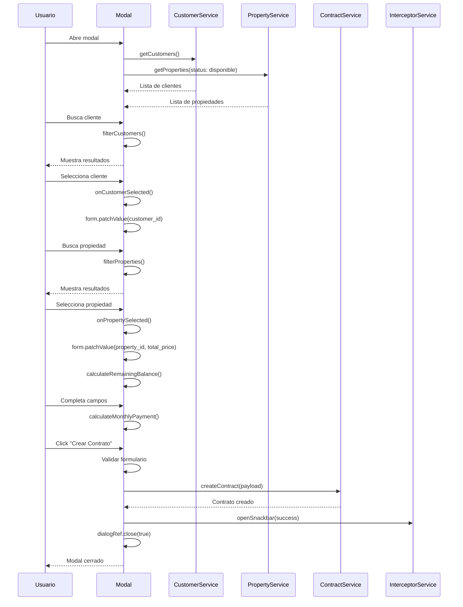
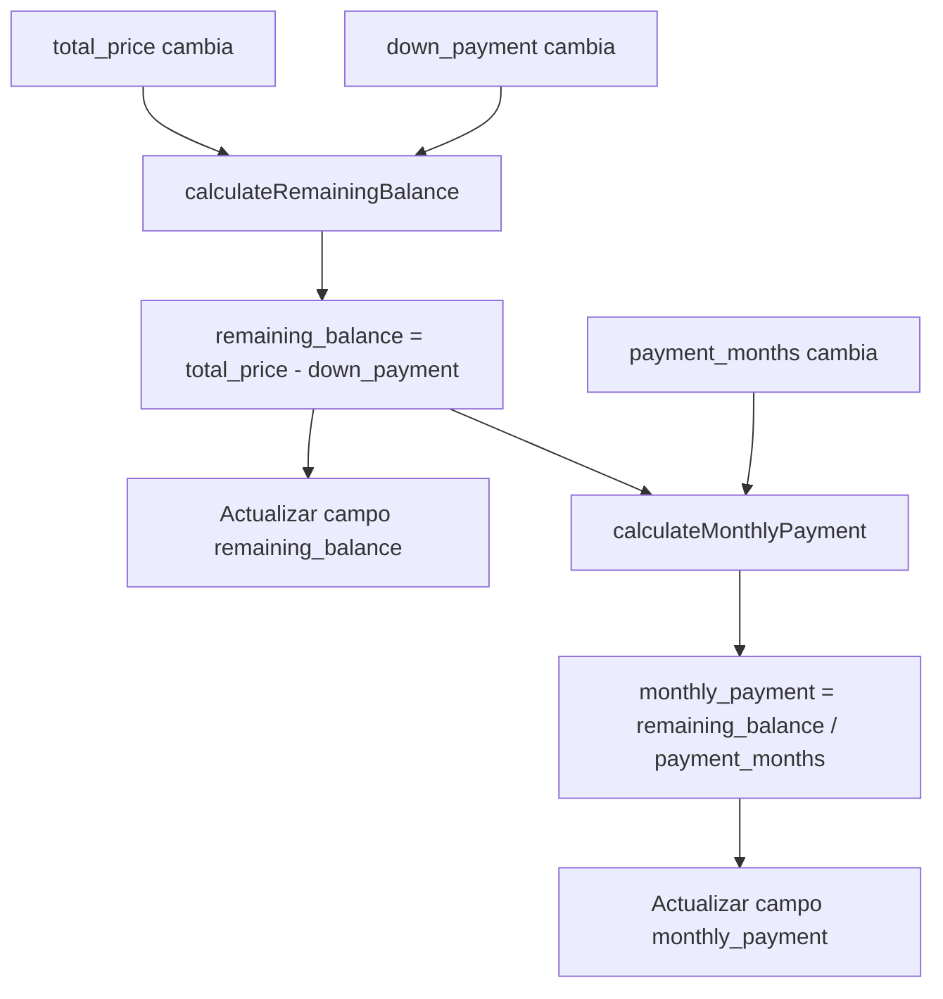

# Diseño Técnico: Modal de Creación de Contratos

## 1. Descripción General

El `ContractCreateModalComponent` es un componente standalone de Angular que implementa un modal de 900px de ancho para la creación de contratos. El componente utiliza MatDialog para la gestión del modal, reactive forms para el manejo del formulario, y componentes custom (app-input, app-select, app-button) para mantener consistencia visual con el resto de la aplicación.

El modal integra funcionalidad de autocompletado para clientes y propiedades, cálculos automáticos en tiempo real para saldo pendiente y pago mensual, y la capacidad de crear clientes sin salir del flujo de creación del contrato.

## 2. Arquitectura

### 2.1 Estructura del Componente

```
src/app/features/contracts/components/contract-create-modal/
├── contract-create-modal.component.ts
├── contract-create-modal.component.html
└── contract-create-modal.component.scss
```

### 2.2 Dependencias

**Servicios:**
- `ContractService`: Para crear contratos mediante `createContract()`
- `CustomerService`: Para buscar clientes con `getCustomers()` y crear nuevos con `createCustomer()`
- `PropertyService`: Para buscar propiedades con `getProperties()`
- `InterceptorService`: Para mostrar notificaciones con `openSnackbar()`

**Componentes:**
- `InputComponent` (app-input): Campos de texto, número, fecha, textarea
- `SelectComponent` (app-select): Selects para moneda y estado
- `ButtonComponent` (app-button): Botones de acción
- `CustomerEditModalComponent`: Modal secundario para crear clientes
- Material Autocomplete: Para búsqueda de clientes y propiedades

**Módulos Angular:**
- `ReactiveFormsModule`: Manejo de formularios reactivos
- `MatDialogModule`: Gestión del modal
- `MatAutocompleteModule`: Autocompletado
- `CommonModule`: Directivas comunes
- `LucideAngularModule`: Iconos

### 2.3 Flujo de Datos

```
Usuario → Formulario Reactivo → Validaciones → Cálculos Automáticos → Submit → ContractService → Backend
                                                                                      ↓
                                                                              Notificación + Cierre
```

## 3. Componentes e Interfaces

### 3.1 Componente Principal

**ContractCreateModalComponent**

```typescript
@Component({
  selector: 'app-contract-create-modal',
  standalone: true,
  imports: [
    CommonModule,
    ReactiveFormsModule,
    MatDialogModule,
    MatAutocompleteModule,
    InputComponent,
    SelectComponent,
    ButtonComponent,
    LucideAngularModule
  ],
  templateUrl: './contract-create-modal.component.html',
  styleUrls: ['./contract-create-modal.component.scss']
})
export class ContractCreateModalComponent implements OnInit {
  // Signals para estado reactivo
  loading = signal(false);
  customers = signal<Customer[]>([]);
  filteredCustomers = signal<Customer[]>([]);
  properties = signal<Property[]>([]);
  filteredProperties = signal<Property[]>([]);
  
  // Formulario reactivo
  form: FormGroup;
  
  // Configuraciones para selects
  currencySelectConfig: ISelect;
  statusSelectConfig: ISelect;
  
  // Iconos
  readonly X = X;
  
  constructor(
    private fb: FormBuilder,
    private dialogRef: MatDialogRef<ContractCreateModalComponent>,
    private contractService: ContractService,
    private customerService: CustomerService,
    private propertyService: PropertyService,
    private interceptorService: InterceptorService,
    private dialog: MatDialog
  ) {}
  
  ngOnInit(): void {
    this.initializeForm();
    this.setupCalculations();
    this.loadCustomers();
    this.loadAvailableProperties();
  }
  
  // Métodos principales
  initializeForm(): void;
  setupCalculations(): void;
  loadCustomers(): void;
  loadAvailableProperties(): void;
  filterCustomers(searchTerm: string): void;
  filterProperties(searchTerm: string): void;
  onCustomerSelected(customer: Customer): void;
  onPropertySelected(property: Property): void;
  openCreateCustomerModal(): void;
  calculateRemainingBalance(): void;
  calculateMonthlyPayment(): void;
  submit(): void;
  close(): void;
}
```

### 3.2 Estructura del Formulario

```typescript
form = this.fb.group({
  // Búsqueda y selección
  customer_search: [''],
  customer_id: [null, Validators.required],
  property_search: [''],
  property_id: ['', Validators.required],
  
  // Datos del contrato
  contract_number: ['', Validators.required],
  contract_date: [this.getTodayDate(), Validators.required],
  total_price: [0, [Validators.required, Validators.min(0)]],
  down_payment: [0, [Validators.required, Validators.min(0)]],
  payment_months: [1, [Validators.required, Validators.min(1)]],
  first_payment_date: ['', Validators.required],
  currency: ['MXN', Validators.required],
  status: ['activo', Validators.required],
  notes: [''],
  
  // Campos calculados (readonly en UI)
  remaining_balance: [{ value: 0, disabled: true }],
  monthly_payment: [{ value: 0, disabled: true }]
});
```

### 3.3 Configuraciones de Select

```typescript
currencySelectConfig: ISelect = {
  placeholder: 'Selecciona una moneda',
  data: [
    { value: 'MXN', label: 'MXN - Peso Mexicano' },
    { value: 'USD', label: 'USD - Dólar' },
    { value: 'EUR', label: 'EUR - Euro' }
  ],
  value: 'value',
  option: 'label',
  form_control: null
};

statusSelectConfig: ISelect = {
  placeholder: 'Selecciona un estado',
  data: [
    { value: 'activo', label: 'Activo' },
    { value: 'completado', label: 'Completado' },
    { value: 'cancelado', label: 'Cancelado' },
    { value: 'suspendido', label: 'Suspendido' }
  ],
  value: 'value',
  option: 'label',
  form_control: null
};
```

## 4. Modelos de Datos

### 4.1 Interfaces Existentes

**CreateContractDto** (ya existe en contract.model.ts)
```typescript
interface CreateContractDto {
  customer_id: number;
  property_id: string;
  contract_number: string;
  contract_date: string;
  total_price: number;
  down_payment: number;
  payment_months: number;
  first_payment_date: string;
  currency: string;
  status?: ContractStatus;
  notes?: string;
}
```

**Customer** (para autocompletado)
```typescript
interface Customer {
  id: number;
  name: string;
  lastname: string;
  email: string;
  phone: string;
  phone_country: string;
  phone_code: string;
}
```

**Property** (para autocompletado)
```typescript
interface Property {
  id: string;
  code: string;
  name: string;
  block: string;
  total_area: number;
  total_price: number;
  status: string;
  measurement_unit?: {
    name: string;
    symbol: string;
  };
}
```

### 4.2 Funciones de Display para Autocomplete

```typescript
displayCustomer(customer: Customer): string {
  return customer ? `${customer.name} ${customer.lastname} (${customer.email})` : '';
}

displayProperty(property: Property): string {
  return property 
    ? `${property.code} - ${property.name} (Mz: ${property.block}, $${property.total_price.toLocaleString()})` 
    : '';
}
```

### 4.3 Cálculos Automáticos

**Saldo Pendiente:**
```typescript
remaining_balance = total_price - down_payment
```

**Pago Mensual:**
```typescript
monthly_payment = remaining_balance / payment_months
```

Estos cálculos se ejecutan automáticamente mediante subscripciones a los cambios de los campos relevantes:

```typescript
setupCalculations(): void {
  // Recalcular saldo pendiente cuando cambia precio total o enganche
  combineLatest([
    this.form.get('total_price')!.valueChanges.pipe(startWith(0)),
    this.form.get('down_payment')!.valueChanges.pipe(startWith(0))
  ]).subscribe(([totalPrice, downPayment]) => {
    this.calculateRemainingBalance();
  });
  
  // Recalcular pago mensual cuando cambia saldo pendiente o meses
  combineLatest([
    this.form.get('remaining_balance')!.valueChanges.pipe(startWith(0)),
    this.form.get('payment_months')!.valueChanges.pipe(startWith(1))
  ]).subscribe(() => {
    this.calculateMonthlyPayment();
  });
}
```

## 5. Lógica de Negocio

### 5.1 Búsqueda de Clientes

```typescript
loadCustomers(): void {
  this.customerService.getCustomers({}).subscribe({
    next: (response) => {
      this.customers.set(response.data || response);
      this.filteredCustomers.set(this.customers());
    },
    error: () => {
      this.interceptorService.openSnackbar({
        type: 'error',
        title: 'Error',
        message: 'No se pudieron cargar los clientes'
      });
    }
  });
}

filterCustomers(searchTerm: string): void {
  if (!searchTerm) {
    this.filteredCustomers.set(this.customers());
    return;
  }
  
  const term = searchTerm.toLowerCase();
  const filtered = this.customers().filter(customer => 
    customer.name.toLowerCase().includes(term) ||
    customer.lastname.toLowerCase().includes(term) ||
    customer.email.toLowerCase().includes(term)
  );
  
  this.filteredCustomers.set(filtered);
}
```

### 5.2 Búsqueda de Propiedades Disponibles

```typescript
loadAvailableProperties(): void {
  this.propertyService.getProperties({ status: 'disponible' }).subscribe({
    next: (response) => {
      this.properties.set(response.data || response);
      this.filteredProperties.set(this.properties());
    },
    error: () => {
      this.interceptorService.openSnackbar({
        type: 'error',
        title: 'Error',
        message: 'No se pudieron cargar las propiedades'
      });
    }
  });
}

filterProperties(searchTerm: string): void {
  if (!searchTerm) {
    this.filteredProperties.set(this.properties());
    return;
  }
  
  const term = searchTerm.toLowerCase();
  const filtered = this.properties().filter(property => 
    property.code.toLowerCase().includes(term) ||
    property.name.toLowerCase().includes(term) ||
    property.block.toLowerCase().includes(term)
  );
  
  this.filteredProperties.set(filtered);
}
```

### 5.3 Selección de Propiedad y Prellenado de Precio

```typescript
onPropertySelected(property: Property): void {
  this.form.patchValue({
    property_id: property.id,
    total_price: property.total_price
  });
}
```

### 5.4 Creación de Cliente desde el Modal

```typescript
openCreateCustomerModal(): void {
  const dialogRef = this.dialog.open(CustomerEditModalComponent, {
    width: '600px',
    data: { customer: null }
  });
  
  dialogRef.afterClosed().subscribe(result => {
    if (result) {
      // Recargar clientes y seleccionar el nuevo
      this.loadCustomers();
      // El nuevo cliente será el último en la lista
      // Podríamos implementar lógica para seleccionarlo automáticamente
    }
  });
}
```

### 5.5 Validación y Envío

```typescript
submit(): void {
  if (this.form.invalid) {
    this.form.markAllAsTouched();
    this.interceptorService.openSnackbar({
      type: 'warning',
      title: 'Advertencia',
      message: 'Completa todos los campos obligatorios'
    });
    return;
  }
  
  // Validación adicional: enganche no puede ser mayor al precio total
  const totalPrice = this.form.get('total_price')!.value;
  const downPayment = this.form.get('down_payment')!.value;
  
  if (downPayment > totalPrice) {
    this.interceptorService.openSnackbar({
      type: 'error',
      title: 'Error',
      message: 'El enganche no puede ser mayor al precio total'
    });
    return;
  }
  
  this.loading.set(true);
  
  const payload: CreateContractDto = {
    customer_id: this.form.get('customer_id')!.value,
    property_id: this.form.get('property_id')!.value,
    contract_number: this.form.get('contract_number')!.value,
    contract_date: this.form.get('contract_date')!.value,
    total_price: this.form.get('total_price')!.value,
    down_payment: this.form.get('down_payment')!.value,
    payment_months: this.form.get('payment_months')!.value,
    first_payment_date: this.form.get('first_payment_date')!.value,
    currency: this.form.get('currency')!.value,
    status: this.form.get('status')!.value,
    notes: this.form.get('notes')!.value || undefined
  };
  
  this.contractService.createContract(payload).subscribe({
    next: () => {
      this.loading.set(false);
      this.interceptorService.openSnackbar({
        type: 'success',
        title: 'Éxito',
        message: 'Contrato creado correctamente'
      });
      this.dialogRef.close(true);
    },
    error: (err) => {
      this.loading.set(false);
      const message = err.error?.message || 'No se pudo crear el contrato';
      this.interceptorService.openSnackbar({
        type: 'error',
        title: 'Error',
        message
      });
    }
  });
}
```

## 6. Diseño de UI

### 6.1 Estructura del Template

```html
<div class="modal-container">
  <!-- Header -->
  <div class="modal-header">
    <h2>Crear Contrato</h2>
    <button (click)="close()">
      <lucide-icon [img]="X"></lucide-icon>
    </button>
  </div>
  
  <!-- Body -->
  <div class="modal-body">
    <form [formGroup]="form">
      <!-- Sección: Cliente -->
      <div class="section">
        <h3>Cliente</h3>
        <div class="autocomplete-with-button">
          <mat-autocomplete>
            <!-- Autocompletado de clientes -->
          </mat-autocomplete>
          <app-button (click)="openCreateCustomerModal()">
            Crear Cliente
          </app-button>
        </div>
      </div>
      
      <!-- Sección: Propiedad -->
      <div class="section">
        <h3>Propiedad</h3>
        <mat-autocomplete>
          <!-- Autocompletado de propiedades -->
        </mat-autocomplete>
      </div>
      
      <!-- Sección: Datos del Contrato -->
      <div class="section">
        <h3>Datos del Contrato</h3>
        <div class="grid grid-cols-2 gap-4">
          <app-input label="Número de Contrato" formControlName="contract_number" />
          <app-input type="date" label="Fecha de Contrato" formControlName="contract_date" />
          <app-input type="number" label="Precio Total" formControlName="total_price" />
          <app-input type="number" label="Enganche" formControlName="down_payment" />
          <app-input type="number" label="Saldo Pendiente" formControlName="remaining_balance" [readonly]="true" />
          <app-input type="number" label="Meses de Pago" formControlName="payment_months" />
          <app-input type="number" label="Pago Mensual" formControlName="monthly_payment" [readonly]="true" />
          <app-input type="date" label="Fecha Primer Pago" formControlName="first_payment_date" />
          <app-select [config]="currencySelectConfig" label="Moneda" />
          <app-select [config]="statusSelectConfig" label="Estado" />
        </div>
        <app-input type="textarea" label="Notas" formControlName="notes" />
      </div>
    </form>
  </div>
  
  <!-- Footer -->
  <div class="modal-footer">
    <app-button variant="secondary" (click)="close()">
      Cancelar
    </app-button>
    <app-button 
      variant="primary" 
      (click)="submit()" 
      [disabled]="form.invalid || loading()"
      [loading]="loading()">
      Crear Contrato
    </app-button>
  </div>
</div>
```

### 6.2 Estilos SCSS

```scss
.modal-container {
  width: 900px;
  max-height: 90vh;
  display: flex;
  flex-direction: column;
}

.modal-header {
  display: flex;
  justify-content: space-between;
  align-items: center;
  padding: 1.5rem;
  border-bottom: 1px solid #e5e7eb;
  
  h2 {
    font-size: 1.5rem;
    font-weight: 600;
    color: #111827;
  }
  
  button {
    padding: 0.5rem;
    border-radius: 0.375rem;
    transition: background-color 0.2s;
    
    &:hover {
      background-color: #f3f4f6;
    }
  }
}

.modal-body {
  flex: 1;
  overflow-y: auto;
  padding: 1.5rem;
  
  .section {
    margin-bottom: 2rem;
    
    h3 {
      font-size: 1.125rem;
      font-weight: 600;
      color: #374151;
      margin-bottom: 1rem;
    }
  }
  
  .autocomplete-with-button {
    display: flex;
    gap: 1rem;
    align-items: flex-end;
  }
}

.modal-footer {
  display: flex;
  justify-content: flex-end;
  gap: 0.75rem;
  padding: 1.5rem;
  border-top: 1px solid #e5e7eb;
}
```

## 7. Manejo de Errores

### 7.1 Errores de Validación

- Campos obligatorios vacíos: Mostrar mensaje "Completa todos los campos obligatorios"
- Enganche mayor al precio total: Mostrar mensaje "El enganche no puede ser mayor al precio total"
- Número de contrato duplicado: El backend retorna error, mostrar mensaje del servidor
- Formato de fecha inválido: Validación HTML5 del input type="date"

### 7.2 Errores de Red

```typescript
error: (err) => {
  this.loading.set(false);
  const message = err.error?.message || 'Error de conexión. Intenta de nuevo.';
  this.interceptorService.openSnackbar({
    type: 'error',
    title: 'Error',
    message
  });
}
```

### 7.3 Casos Edge

**No hay propiedades disponibles:**
```typescript
<div *ngIf="filteredProperties().length === 0" class="no-results">
  <p>No hay lotes disponibles</p>
  <p class="text-sm text-gray-500">Crea un lote primero para poder crear contratos</p>
</div>
```

**No se encontraron clientes:**
```typescript
<div *ngIf="filteredCustomers().length === 0" class="no-results">
  <p>No se encontraron clientes</p>
  <app-button (click)="openCreateCustomerModal()">
    Crear Cliente
  </app-button>
</div>
```


## 8. Propiedades de Corrección

*Una propiedad es una característica o comportamiento que debe mantenerse verdadero en todas las ejecuciones válidas de un sistema - esencialmente, una declaración formal sobre lo que el sistema debe hacer. Las propiedades sirven como puente entre las especificaciones legibles por humanos y las garantías de corrección verificables por máquina.*

### Propiedad 1: Búsqueda de clientes por múltiples campos
*Para cualquier* conjunto de clientes y término de búsqueda, los resultados filtrados deben incluir solo clientes cuyo nombre, apellido o email contengan el término de búsqueda (sin distinción de mayúsculas/minúsculas).
**Valida: Requisitos 2.1.2**

### Propiedad 2: Selección de cliente actualiza el formulario
*Para cualquier* cliente seleccionado del autocompletado, el campo customer_id del formulario debe establecerse con el ID del cliente seleccionado.
**Valida: Requisitos 2.1.4**

### Propiedad 3: Búsqueda de propiedades por múltiples campos
*Para cualquier* conjunto de propiedades y término de búsqueda, los resultados filtrados deben incluir solo propiedades cuyo código, nombre o manzana contengan el término de búsqueda (sin distinción de mayúsculas/minúsculas).
**Valida: Requisitos 2.3.2**

### Propiedad 4: Filtrado de propiedades disponibles
*Para cualquier* conjunto de propiedades con estados mixtos, solo las propiedades con status "disponible" deben aparecer en los resultados del autocompletado.
**Valida: Requisitos 2.3.3**

### Propiedad 5: Display de propiedades contiene información requerida
*Para cualquier* propiedad, la cadena de display generada por displayProperty() debe contener el código, nombre, manzana y precio de la propiedad.
**Valida: Requisitos 2.3.4**

### Propiedad 6: Selección de propiedad prellena el precio total
*Para cualquier* propiedad seleccionada del autocompletado, el campo total_price del formulario debe establecerse con el total_price de la propiedad seleccionada.
**Valida: Requisitos 2.3.5**

### Propiedad 7: Cálculo automático del saldo pendiente
*Para cualquier* valor de precio total (total_price) y enganche (down_payment), el saldo pendiente (remaining_balance) debe calcularse como: remaining_balance = total_price - down_payment.
**Valida: Requisitos 2.4.2, 2.5.1**

### Propiedad 8: Cálculo automático del pago mensual
*Para cualquier* valor de saldo pendiente (remaining_balance) y meses de pago (payment_months > 0), el pago mensual (monthly_payment) debe calcularse como: monthly_payment = remaining_balance / payment_months.
**Valida: Requisitos 2.4.3, 2.5.2**

### Propiedad 9: Validación de campos obligatorios
*Para cualquier* estado del formulario donde falte al menos un campo obligatorio (customer_id, property_id, contract_number, contract_date, total_price, down_payment, payment_months, first_payment_date, currency, status), el formulario debe ser inválido y la función submit() debe retornar sin enviar datos.
**Valida: Requisitos 2.4.4, 2.1.5, 2.3.6**

### Propiedad 10: Formateo de números con separadores de miles
*Para cualquier* número mayor o igual a 1000, la función de formateo debe insertar separadores de miles (comas) en las posiciones correctas.
**Valida: Requisitos 2.5.3**

### Propiedad 11: Botón deshabilitado con formulario inválido
*Para cualquier* estado del formulario donde form.invalid sea true, el botón "Crear Contrato" debe tener el atributo disabled establecido en true.
**Valida: Requisitos 2.6.2**

### Propiedad 12: Validación de enganche no mayor al precio total
*Para cualquier* valor de enganche (down_payment) que sea mayor al precio total (total_price), la función submit() debe mostrar un mensaje de error y no enviar la solicitud al backend.
**Valida: Requisitos implícitos de validación de negocio**

## 9. Estrategia de Pruebas

### 9.1 Enfoque Dual de Pruebas

Este componente requiere tanto pruebas unitarias como pruebas basadas en propiedades para garantizar corrección completa:

**Pruebas Unitarias:**
- Ejemplos específicos de interacciones de UI
- Casos edge como listas vacías
- Condiciones de error específicas
- Integración con MatDialog

**Pruebas Basadas en Propiedades:**
- Propiedades universales que se mantienen para todas las entradas
- Cobertura exhaustiva de entradas mediante aleatorización
- Validación de cálculos matemáticos
- Validación de lógica de filtrado

### 9.2 Configuración de Pruebas Basadas en Propiedades

**Biblioteca:** fast-check (para TypeScript/JavaScript)

**Configuración:**
- Mínimo 100 iteraciones por prueba de propiedad
- Cada prueba debe referenciar su propiedad del documento de diseño
- Formato de etiqueta: `Feature: contract-creation-modal, Property {número}: {texto de propiedad}`

**Ejemplo de implementación:**
```typescript
import fc from 'fast-check';

describe('Feature: contract-creation-modal, Property 7: Cálculo automático del saldo pendiente', () => {
  it('should calculate remaining_balance as total_price - down_payment for any values', () => {
    fc.assert(
      fc.property(
        fc.float({ min: 0, max: 10000000 }), // total_price
        fc.float({ min: 0, max: 10000000 }), // down_payment
        (totalPrice, downPayment) => {
          component.form.patchValue({
            total_price: totalPrice,
            down_payment: downPayment
          });
          
          const expectedBalance = totalPrice - downPayment;
          const actualBalance = component.form.get('remaining_balance')!.value;
          
          expect(actualBalance).toBeCloseTo(expectedBalance, 2);
        }
      ),
      { numRuns: 100 }
    );
  });
});
```

### 9.3 Casos de Prueba Unitaria

**Estructura de UI:**
- Verificar que el modal contiene campo de autocompletado de clientes
- Verificar que existe el botón "Crear Cliente"
- Verificar que el modal contiene campo de autocompletado de propiedades
- Verificar que existen todos los campos del formulario
- Verificar que existe el botón "Crear Contrato"
- Verificar que existe el botón X de cierre

**Interacciones:**
- Hacer clic en "Crear Cliente" abre CustomerEditModalComponent
- Hacer clic en "Crear Contrato" con formulario válido llama a contractService.createContract()
- Hacer clic en X cierra el modal sin guardar
- Seleccionar un cliente actualiza customer_id
- Seleccionar una propiedad actualiza property_id y total_price

**Casos Edge:**
- Lista de clientes vacía muestra mensaje apropiado
- Lista de propiedades vacía muestra mensaje apropiado
- Búsqueda sin resultados muestra mensaje apropiado
- Error de red muestra notificación de error
- Éxito muestra notificación de éxito y cierra modal

**Validaciones:**
- Formulario inválido deshabilita botón de submit
- Enganche mayor al precio total muestra error
- Campos obligatorios vacíos previenen submit

### 9.4 Generadores para Pruebas de Propiedades

```typescript
// Generador de clientes aleatorios
const customerArbitrary = fc.record({
  id: fc.integer({ min: 1, max: 10000 }),
  name: fc.string({ minLength: 1, maxLength: 50 }),
  lastname: fc.string({ minLength: 1, maxLength: 50 }),
  email: fc.emailAddress(),
  phone: fc.string({ minLength: 10, maxLength: 15 }),
  phone_country: fc.constantFrom('MX', 'US', 'ES'),
  phone_code: fc.constantFrom('+52', '+1', '+34')
});

// Generador de propiedades aleatorias
const propertyArbitrary = fc.record({
  id: fc.uuid(),
  code: fc.string({ minLength: 1, maxLength: 20 }),
  name: fc.string({ minLength: 1, maxLength: 100 }),
  block: fc.string({ minLength: 1, maxLength: 10 }),
  total_area: fc.float({ min: 1, max: 10000 }),
  total_price: fc.float({ min: 1000, max: 10000000 }),
  status: fc.constantFrom('disponible', 'vendido', 'reservado')
});

// Generador de términos de búsqueda
const searchTermArbitrary = fc.string({ minLength: 0, maxLength: 50 });

// Generador de valores monetarios
const monetaryValueArbitrary = fc.float({ 
  min: 0, 
  max: 10000000,
  noNaN: true,
  noDefaultInfinity: true
});

// Generador de meses de pago
const paymentMonthsArbitrary = fc.integer({ min: 1, max: 360 });
```

### 9.5 Cobertura de Requisitos

Cada requisito testeable debe tener al menos una prueba que lo valide:

| Requisito | Tipo de Prueba | Propiedad/Caso |
|-----------|----------------|----------------|
| 2.1.1 | Unitaria | UI contiene autocomplete de clientes |
| 2.1.2 | Propiedad | Propiedad 1 |
| 2.1.4 | Propiedad | Propiedad 2 |
| 2.1.5 | Propiedad | Propiedad 9 |
| 2.2.1 | Unitaria | UI contiene botón "Crear Cliente" |
| 2.2.2 | Unitaria | Click abre CustomerEditModalComponent |
| 2.3.1 | Unitaria | UI contiene autocomplete de propiedades |
| 2.3.2 | Propiedad | Propiedad 3 |
| 2.3.3 | Propiedad | Propiedad 4 |
| 2.3.4 | Propiedad | Propiedad 5 |
| 2.3.5 | Propiedad | Propiedad 6 |
| 2.3.6 | Propiedad | Propiedad 9 |
| 2.4.1 | Unitaria | UI contiene todos los campos |
| 2.4.2 | Propiedad | Propiedad 7 |
| 2.4.3 | Propiedad | Propiedad 8 |
| 2.4.4 | Propiedad | Propiedad 9 |
| 2.5.3 | Propiedad | Propiedad 10 |
| 2.6.1 | Unitaria | UI contiene botón "Crear Contrato" |
| 2.6.2 | Propiedad | Propiedad 11 |
| 2.6.3 | Unitaria | Click establece loading signal |
| 2.6.4 | Unitaria | Éxito muestra notificación |
| 2.6.5 | Unitaria | Éxito cierra modal |
| 2.6.7 | Unitaria | Error muestra notificación |
| 2.6.8 | Unitaria | Error mantiene modal abierto |
| 2.7.1 | Unitaria | UI contiene botón X |
| 2.7.2 | Unitaria | Click en X cierra modal |

### 9.6 Balance de Pruebas

**Evitar exceso de pruebas unitarias:**
- Las pruebas basadas en propiedades manejan la cobertura de múltiples entradas
- Las pruebas unitarias deben enfocarse en:
  - Ejemplos específicos que demuestran comportamiento correcto
  - Puntos de integración entre componentes
  - Casos edge y condiciones de error
  
**Enfoque de pruebas de propiedades:**
- Propiedades universales que se mantienen para todas las entradas
- Cobertura exhaustiva mediante aleatorización
- Cada propiedad de corrección debe implementarse como UNA SOLA prueba basada en propiedad

## 10. Integración

### 10.1 Apertura del Modal

Desde `contracts-list.component.ts`:

```typescript
openCreateContractModal(): void {
  const dialogRef = this.dialog.open(ContractCreateModalComponent, {
    width: '900px',
    disableClose: false
  });
  
  dialogRef.afterClosed().subscribe(result => {
    if (result) {
      // Recargar lista de contratos
      this.getContracts();
    }
  });
}
```

### 10.2 Cierre del Modal

El modal cierra con `true` si se creó exitosamente, o `undefined` si se canceló:

```typescript
// Éxito
this.dialogRef.close(true);

// Cancelar
this.dialogRef.close();
```

### 10.3 Recarga de Datos

El componente padre debe recargar la lista de contratos cuando el modal cierra con éxito. Si existe un método `clearCache()` en el servicio, debe llamarse antes de recargar.

## 11. Consideraciones de Rendimiento

### 11.1 Debouncing de Búsqueda

Para evitar llamadas excesivas durante la escritura, implementar debouncing en los campos de autocompletado:

```typescript
this.form.get('customer_search')!.valueChanges
  .pipe(
    debounceTime(300),
    distinctUntilChanged()
  )
  .subscribe(searchTerm => {
    this.filterCustomers(searchTerm);
  });
```

### 11.2 Carga Inicial

Cargar clientes y propiedades en paralelo durante `ngOnInit()`:

```typescript
ngOnInit(): void {
  this.initializeForm();
  this.setupCalculations();
  
  // Cargar datos en paralelo
  forkJoin({
    customers: this.customerService.getCustomers({}),
    properties: this.propertyService.getProperties({ status: 'disponible' })
  }).subscribe({
    next: ({ customers, properties }) => {
      this.customers.set(customers.data || customers);
      this.properties.set(properties.data || properties);
      this.filteredCustomers.set(this.customers());
      this.filteredProperties.set(this.properties());
    },
    error: () => {
      this.interceptorService.openSnackbar({
        type: 'error',
        title: 'Error',
        message: 'No se pudieron cargar los datos iniciales'
      });
    }
  });
}
```

### 11.3 Optimización de Cálculos

Los cálculos automáticos ya están optimizados mediante `combineLatest` que solo recalcula cuando cambian los valores relevantes.

## 12. Accesibilidad

### 12.1 Etiquetas ARIA

```html
<input 
  matInput
  [formControl]="customerSearchControl"
  [matAutocomplete]="autoCustomer"
  aria-label="Buscar cliente"
  aria-describedby="customer-help-text"
  placeholder="Buscar por nombre, apellido o email">
```

### 12.2 Navegación por Teclado

- Tab: Navegar entre campos
- Enter: Seleccionar opción de autocompletado
- Escape: Cerrar modal
- Enter en botón "Crear Contrato": Enviar formulario

### 12.3 Mensajes de Error

Los mensajes de error deben ser descriptivos y asociados con los campos mediante `aria-describedby`.

## 13. Diagramas

### 13.1 Flujo de Creación de Contrato



### 13.2 Flujo de Cálculos Automáticos



## 14. Resumen

El `ContractCreateModalComponent` es un componente complejo que integra múltiples funcionalidades:

1. **Autocompletado dual**: Búsqueda de clientes y propiedades con filtrado en tiempo real
2. **Creación anidada**: Capacidad de crear clientes sin salir del flujo
3. **Cálculos automáticos**: Saldo pendiente y pago mensual se calculan reactivamente
4. **Validación robusta**: Validaciones de formulario y de negocio
5. **Manejo de errores**: Mensajes descriptivos para todos los casos de error
6. **Integración limpia**: Cierre con resultado para que el padre recargue datos

El diseño sigue los patrones establecidos en otros modales de la aplicación, utiliza los componentes custom existentes, y mantiene la consistencia visual con Tailwind CSS. Las pruebas basadas en propiedades garantizan corrección matemática y lógica, mientras que las pruebas unitarias validan interacciones específicas y casos edge.
