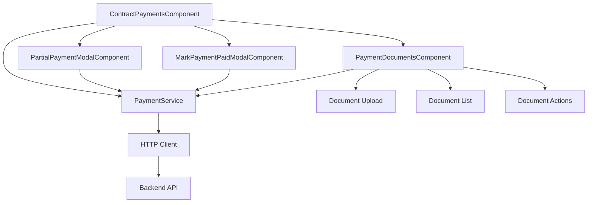
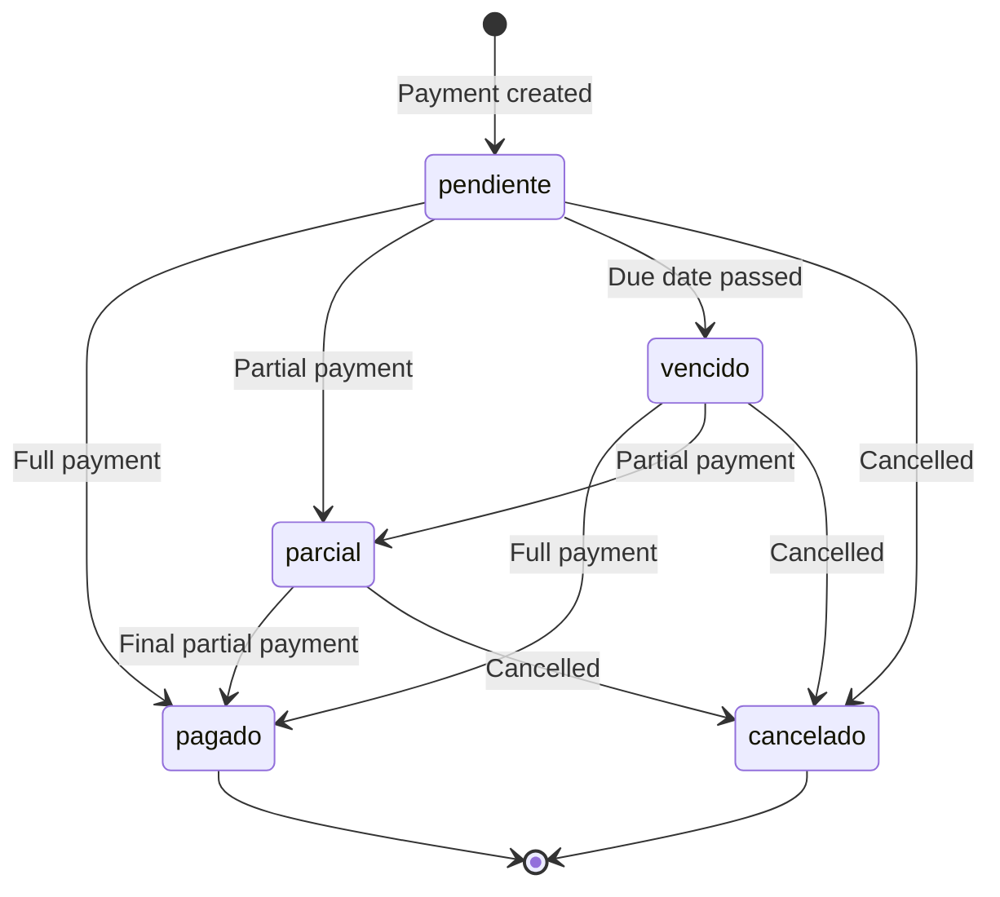

# Design Document: Partial Payment Support

## Overview

This design extends the contract payments system to support partial payments, allowing users to pay amounts in installments while tracking payment progress. The system will maintain backward compatibility with full payments while adding new capabilities for partial payment registration, progress tracking, and document management.

The implementation follows Angular 18+ patterns with standalone components, signals for reactive state, and existing UI component patterns. The API already supports partial payments, so this design focuses on the frontend integration.

## Architecture

### High-Level Architecture



### Component Hierarchy

- **ContractPaymentsComponent** (existing, updated)
  - Displays payment list with stats
  - Shows partial payment progress (amount_paid/amount_pending)
  - Provides action buttons for full and partial payments
  
- **PartialPaymentModalComponent** (new)
  - Modal for registering partial payments
  - Validates payment amount against remaining balance
  - Captures payment details (date, method, reference, notes)
  
- **MarkPaymentPaidModalComponent** (existing, unchanged)
  - Continues to handle full payment registration
  
- **PaymentDocumentsComponent** (new)
  - Displays list of documents for a payment
  - Handles document upload with validation
  - Provides document download and deletion

### Data Flow

1. **Payment Display Flow**
   - Component loads payments via PaymentService
   - Payment model includes partial payment fields
   - UI displays status badges and progress information
   - Stats include partial_count

2. **Partial Payment Registration Flow**
   - User clicks "Pago Parcial" button
   - Modal opens with current payment details
   - User enters amount and payment details
   - Validation ensures amount ≤ amount_pending
   - Service calls API endpoint
   - API updates amount_paid, amount_pending, status
   - Component refreshes payment list and stats

3. **Document Management Flow**
   - User uploads document via file input
   - Validation checks file size (≤10MB) and format
   - Service sends FormData to API
   - API stores document and returns metadata
   - Component displays document in list
   - User can download (generates temporary URL) or delete

## Components and Interfaces

### Updated Payment Model

```typescript
export interface Payment {
  id: string;
  contract_id: string;
  payment_number: number;
  amount: number;
  amount_paid: number;              // NEW
  amount_pending: number;           // NEW
  due_date: string;
  paid_date: string | null;
  first_partial_payment_date: string | null;  // NEW
  status: PaymentStatus;            // Updated to include 'parcial'
  payment_method: string | null;
  reference_number: string | null;
  notes: string | null;
  created_at: string;
  updated_at: string;
}

export type PaymentStatus = 'pendiente' | 'pagado' | 'parcial' | 'vencido' | 'cancelado';

export interface PaymentStats {
  total_payments: number;
  paid_count: number;
  pending_count: number;
  partial_count: number;            // NEW
  overdue_count: number;
  cancelled_count: number;
  total_paid: number;
  total_pending: number;
  next_payment: {
    payment_number: number;
    due_date: string;
    amount: number;
  } | null;
}

export interface RegisterPartialPaymentDto {
  amount: number;
  payment_date: string;
  payment_method: string;
  reference_number?: string;
  notes?: string;
}
```

### New Payment Document Model

```typescript
export interface PaymentDocument {
  id: string;
  payment_id: string;
  document_type: DocumentType;
  file_name: string;
  file_size: number;
  file_url: string;
  notes: string | null;
  uploaded_at: string;
}

export type DocumentType = 
  | 'comprobante_transferencia' 
  | 'foto_deposito' 
  | 'recibo' 
  | 'factura' 
  | 'otro';

export interface UploadDocumentDto {
  file: File;
  document_type: DocumentType;
  notes?: string;
}
```

### Updated PaymentService

```typescript
class PaymentService {
  // Existing methods remain unchanged
  
  // NEW: Register partial payment
  registerPartialPayment(
    contractId: string, 
    paymentId: string, 
    data: RegisterPartialPaymentDto
  ): Observable<Payment>
  
  // NEW: Upload document
  uploadDocument(
    contractId: string, 
    paymentId: string, 
    data: UploadDocumentDto
  ): Observable<PaymentDocument>
  
  // NEW: Get documents for payment
  getDocuments(
    contractId: string, 
    paymentId: string
  ): Observable<PaymentDocument[]>
  
  // NEW: Get temporary download URL
  getDocumentUrl(
    contractId: string, 
    paymentId: string, 
    documentId: string,
    expiresIn?: number
  ): Observable<{ url: string }>
  
  // NEW: Delete document
  deleteDocument(
    contractId: string, 
    paymentId: string, 
    documentId: string
  ): Observable<void>
}
```

### PartialPaymentModalComponent

**Purpose**: Modal dialog for registering partial payments

**Inputs**:
- `payment: Payment` - The payment being partially paid
- `contractId: string` - The contract ID
- `currency: string` - Currency symbol for display

**State**:
- `form: FormGroup` - Reactive form with fields:
  - `amount: number` (required, min: 0.01, max: amount_pending)
  - `payment_date: string` (required, date format)
  - `payment_method: string` (required, select)
  - `reference_number: string` (optional)
  - `notes: string` (optional)
- `saving: signal<boolean>` - Loading state during save

**Methods**:
- `save()` - Validates and submits partial payment
- `close()` - Closes modal without saving
- `validateAmount()` - Custom validator for amount field

**Validation Rules**:
- Amount must be > 0
- Amount must be ≤ amount_pending
- Payment date is required
- Payment method is required

### PaymentDocumentsComponent

**Purpose**: Display and manage documents for a payment

**Inputs**:
- `contractId: string` - The contract ID
- `paymentId: string` - The payment ID

**State**:
- `documents: signal<PaymentDocument[]>` - List of documents
- `uploading: signal<boolean>` - Upload in progress
- `uploadForm: FormGroup` - Form for document upload
  - `file: File` (required)
  - `document_type: DocumentType` (required)
  - `notes: string` (optional)

**Methods**:
- `loadDocuments()` - Fetches documents from API
- `onFileSelected(event)` - Handles file input change
- `uploadDocument()` - Validates and uploads document
- `downloadDocument(doc)` - Gets temporary URL and opens in new tab
- `deleteDocument(doc)` - Confirms and deletes document
- `validateFile(file)` - Validates file size and format

**File Validation**:
- Max size: 10MB (10 * 1024 * 1024 bytes)
- Allowed formats: PDF, JPG, JPEG, PNG, HEIC
- Validation performed before upload

### Updated ContractPaymentsComponent

**New/Updated Methods**:
- `markAsPartiallyPaid(payment)` - Opens partial payment modal
- `getStatusClass(status)` - Updated to include 'parcial' styling
- `getStatusLabel(status)` - Updated to include 'Parcial' label
- `canMarkAsPartiallyPaid(payment)` - Determines if partial payment button should show

**UI Updates**:
- Display amount_paid and amount_pending for partial payments
- Show "Pago Parcial" button alongside "Marcar como Pagado"
- Display partial_count in stats section
- Show first_partial_payment_date when available
- Integrate PaymentDocumentsComponent for each payment row

## Data Models

### Payment State Transitions



### Payment Amount Calculations

The API handles all calculations, but the frontend must understand the relationships:

- `amount`: Original total amount due
- `amount_paid`: Cumulative sum of all partial payments
- `amount_pending`: `amount - amount_paid`
- When `amount_pending` reaches 0, status becomes 'pagado'
- When `amount_pending` > 0 after a partial payment, status is 'parcial'

### Document Storage

Documents are stored on the backend with metadata. The frontend:
- Uploads files as FormData
- Receives document metadata in response
- Requests temporary signed URLs for downloads
- URLs expire after specified time (default 3600 seconds)


## Correctness Properties

A property is a characteristic or behavior that should hold true across all valid executions of a system—essentially, a formal statement about what the system should do. Properties serve as the bridge between human-readable specifications and machine-verifiable correctness guarantees.

### Property 1: Payment Amount Invariant

*For any* payment with partial payment support, the sum of amount_paid and amount_pending must always equal the original amount.

**Validates: Requirements 2.2, 2.3**

This is an invariant property that ensures the accounting is always correct. No matter how many partial payments are made, the total must remain consistent.

### Property 2: Partial Payment Amount Validation

*For any* partial payment registration attempt, if the payment amount exceeds the amount_pending, the system must reject the payment.

**Validates: Requirements 2.1, 6.3**

This is an error condition property that ensures users cannot overpay through the partial payment interface.

### Property 3: Status Transition to Paid

*For any* payment where partial payments sum to the total amount (amount_pending reaches zero), the status must transition to 'pagado'.

**Validates: Requirements 2.4**

This property ensures that the system correctly recognizes when a payment is fully completed through partial payments.

### Property 4: Status Remains Partial

*For any* payment where a partial payment is registered but amount_pending remains greater than zero, the status must be 'parcial'.

**Validates: Requirements 2.5**

This property ensures that incomplete payments are correctly marked as partial.

### Property 5: Payment Details Persistence

*For any* partial payment registration, the payment_date, payment_method, reference_number, and notes provided must be retrievable after the payment is recorded.

**Validates: Requirements 2.6**

This is a round-trip property ensuring that payment details are correctly persisted and retrievable.

### Property 6: Amount Validation - Positive Values

*For any* payment amount entered in the partial payment form, amounts less than or equal to zero must be rejected by validation.

**Validates: Requirements 6.2**

This is an error condition property ensuring only positive payment amounts are accepted.

### Property 7: File Size Validation

*For any* document upload attempt, files larger than 10MB (10,485,760 bytes) must be rejected before upload.

**Validates: Requirements 7.1**

This is an error condition property ensuring file size limits are enforced on the client side.

### Property 8: File Format Validation

*For any* document upload attempt, files with extensions other than .pdf, .jpg, .jpeg, .png, or .heic must be rejected before upload.

**Validates: Requirements 7.2**

This is an error condition property ensuring only supported file formats are uploaded.

## Error Handling

### Validation Errors

**Client-Side Validation**:
- Form validation using Angular Validators
- Custom validators for amount range (0 < amount ≤ amount_pending)
- File validation before upload (size and format)
- Display validation errors inline with form fields

**Server-Side Validation**:
- API may return validation errors
- Display error messages from API response
- Use InterceptorService for consistent error handling

### Network Errors

- HTTP errors handled by InterceptorService
- Display user-friendly messages via snackbar
- Retry logic not implemented (user can manually retry)

### File Upload Errors

- File size exceeded: "El archivo excede el tamaño máximo de 10MB"
- Invalid format: "Formato de archivo no válido. Use PDF, JPG, PNG o HEIC"
- Upload failed: Display API error message
- Network error: "Error de conexión. Intente nuevamente"

### State Management Errors

- If payment list fails to load, show error message
- If stats fail to load, silently fail (stats are optional)
- If document list fails to load, show error in documents section
- Always allow user to retry failed operations

## Testing Strategy

### Dual Testing Approach

This feature requires both unit tests and property-based tests to ensure comprehensive coverage:

- **Unit tests**: Verify specific examples, edge cases, UI rendering, and component integration
- **Property tests**: Verify universal properties across all inputs, especially validation and state transitions

### Property-Based Testing

We will use **fast-check** (for TypeScript/JavaScript) to implement property-based tests. Each property test will:
- Run a minimum of 100 iterations with randomized inputs
- Reference the design document property it validates
- Use the tag format: **Feature: partial-payment-support, Property N: [property text]**

**Property Test Examples**:

1. **Property 1: Payment Amount Invariant**
   - Generate random payments with various amounts
   - Apply random sequences of partial payments
   - Assert: amount_paid + amount_pending === amount (always)

2. **Property 2: Partial Payment Amount Validation**
   - Generate random payments with amount_pending
   - Generate payment amounts > amount_pending
   - Assert: validation rejects all invalid amounts

3. **Property 6: Amount Validation - Positive Values**
   - Generate random negative and zero amounts
   - Assert: form validation marks field as invalid

4. **Property 7: File Size Validation**
   - Generate mock files with sizes > 10MB
   - Assert: validation rejects all oversized files

5. **Property 8: File Format Validation**
   - Generate mock files with invalid extensions
   - Assert: validation rejects all invalid formats

### Unit Testing

Unit tests will focus on:

**Component Tests**:
- PartialPaymentModalComponent
  - Form initialization with correct validators
  - Save method calls service with form values
  - Close method closes dialog
  - Error handling displays messages
  
- PaymentDocumentsComponent
  - Document list renders all documents
  - Upload triggers service call
  - Download generates URL and opens tab
  - Delete shows confirmation and calls service
  
- ContractPaymentsComponent updates
  - Partial payment button shows for eligible payments
  - Status badge displays correct class for 'parcial'
  - Amount paid/pending displayed for partial payments
  - Stats include partial_count

**Service Tests**:
- PaymentService new methods
  - registerPartialPayment calls correct endpoint
  - uploadDocument sends FormData correctly
  - getDocuments returns document array
  - getDocumentUrl includes expiresIn parameter
  - deleteDocument calls correct endpoint
  - Errors propagate to caller

**Model Tests**:
- Payment model includes new fields
- PaymentStatus type includes 'parcial'
- PaymentDocument model structure
- DTO interfaces match API contracts

### Integration Testing

While not part of the initial implementation, integration tests should verify:
- Full flow: register partial payment → verify UI updates
- Full flow: upload document → verify document appears → download → delete
- Multiple partial payments completing a payment
- Error scenarios with API failures

### Test Coverage Goals

- Unit test coverage: >80% for new components and services
- Property test coverage: All 8 correctness properties implemented
- Edge cases: Zero amounts, exact amount_pending, file size boundaries
- Error paths: API failures, validation failures, network errors
