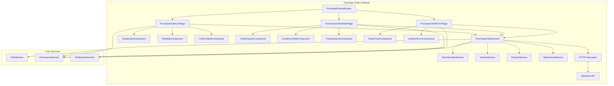
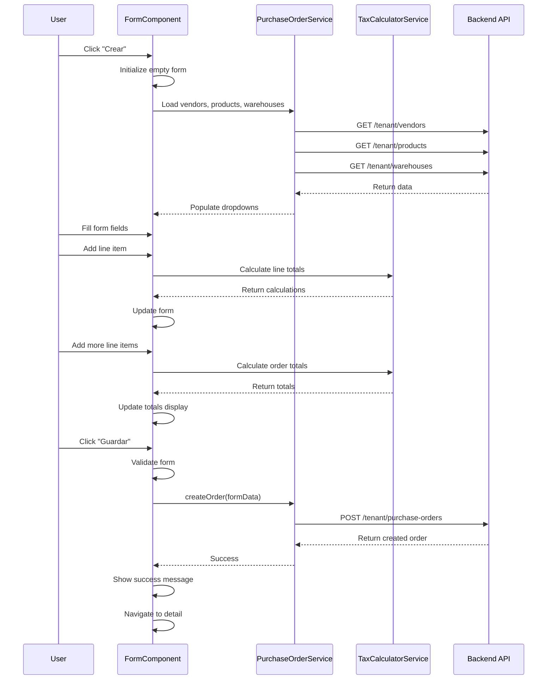
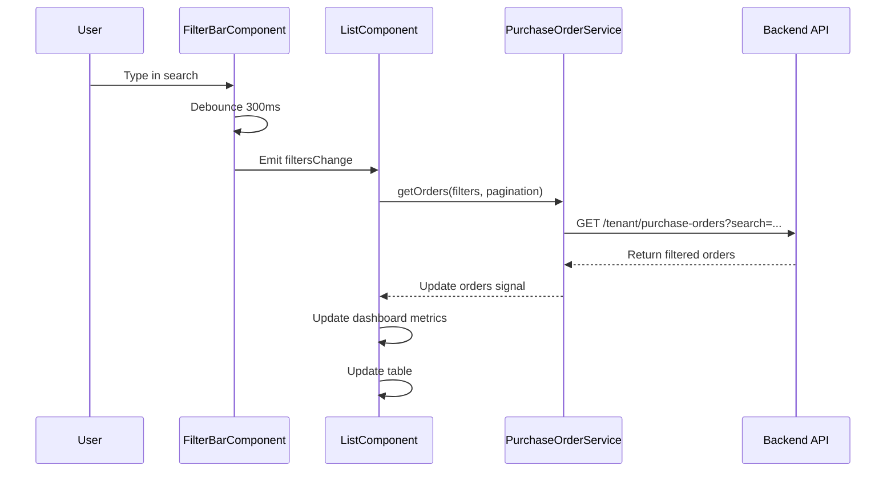
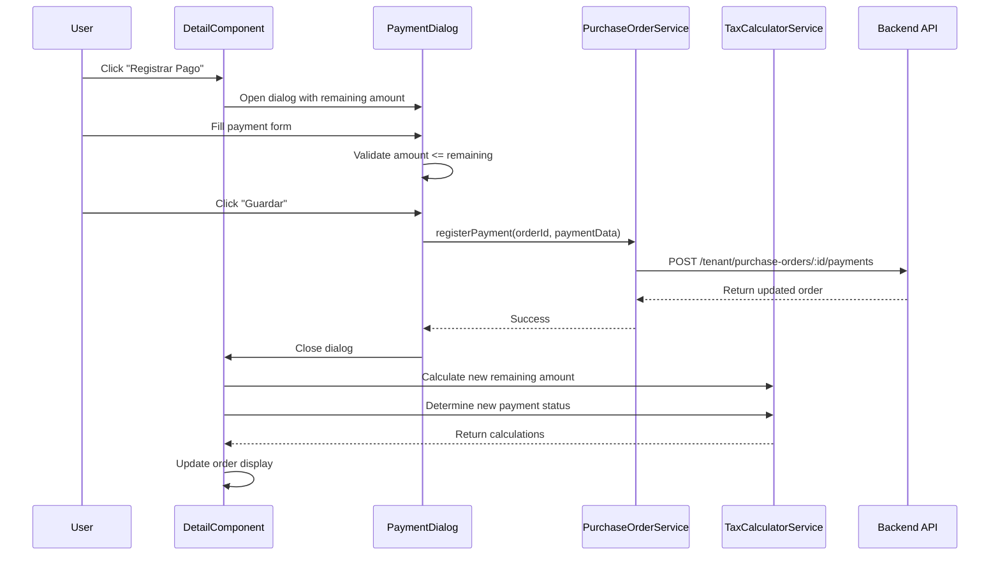

# Purchase Orders Module - Technical Design

## Overview

El módulo de Purchase Orders es una aplicación Angular standalone que permite gestionar el ciclo completo de órdenes de compra, desde su creación hasta su recepción y pago. El módulo se integra con APIs REST existentes para proveedores, productos, almacenes e inventario, proporcionando una interfaz de usuario completa y responsive para la gestión de compras.

### Key Features

- Creación y edición de órdenes de compra con múltiples líneas de productos
- Cálculo automático de impuestos (IVA, IEPS) y totales
- Gestión de estados (En Proceso, Recibida, Cancelada)
- Registro de pagos parciales y totales
- Dashboard con métricas visuales
- Filtrado avanzado y búsqueda en tiempo real
- Integración automática con inventario
- Control de acceso basado en permisos RBAC
- Diseño responsive (desktop, tablet, mobile)

### Technology Stack

- **Framework**: Angular 17+ (Standalone Components)
- **UI Library**: PrimeNG
- **State Management**: RxJS + Signals
- **HTTP Client**: Angular HttpClient
- **Forms**: Reactive Forms
- **Routing**: Angular Router
- **Authentication**: JWT Bearer Token
- **Testing**: Vitest + fast-check (property-based testing)

## Architecture

### High-Level Architecture



### Module Structure

```
src/app/features/purchase-orders/
├── components/
│   ├── dashboard/
│   │   ├── dashboard.component.ts
│   │   ├── dashboard.component.html
│   │   └── dashboard.component.scss
│   ├── filter-bar/
│   │   ├── filter-bar.component.ts
│   │   ├── filter-bar.component.html
│   │   └── filter-bar.component.scss
│   ├── orders-table/
│   │   ├── orders-table.component.ts
│   │   ├── orders-table.component.html
│   │   └── orders-table.component.scss
│   ├── order-header/
│   │   ├── order-header.component.ts
│   │   ├── order-header.component.html
│   │   └── order-header.component.scss
│   ├── line-items-table/
│   │   ├── line-items-table.component.ts
│   │   ├── line-items-table.component.html
│   │   └── line-items-table.component.scss
│   ├── payments-list/
│   │   ├── payments-list.component.ts
│   │   ├── payments-list.component.html
│   │   └── payments-list.component.scss
│   ├── order-form/
│   │   ├── order-form.component.ts
│   │   ├── order-form.component.html
│   │   └── order-form.component.scss
│   ├── line-item-form/
│   │   ├── line-item-form.component.ts
│   │   ├── line-item-form.component.html
│   │   └── line-item-form.component.scss
│   ├── payment-dialog/
│   │   ├── payment-dialog.component.ts
│   │   ├── payment-dialog.component.html
│   │   └── payment-dialog.component.scss
│   └── cancel-dialog/
│       ├── cancel-dialog.component.ts
│       ├── cancel-dialog.component.html
│       └── cancel-dialog.component.scss
├── pages/
│   ├── purchase-order-list/
│   │   ├── purchase-order-list.component.ts
│   │   ├── purchase-order-list.component.html
│   │   └── purchase-order-list.component.scss
│   ├── purchase-order-detail/
│   │   ├── purchase-order-detail.component.ts
│   │   ├── purchase-order-detail.component.html
│   │   └── purchase-order-detail.component.scss
│   └── purchase-order-form/
│       ├── purchase-order-form.component.ts
│       ├── purchase-order-form.component.html
│       └── purchase-order-form.component.scss
├── services/
│   ├── purchase-order.service.ts
│   ├── purchase-order.service.spec.ts
│   ├── tax-calculator.service.ts
│   ├── tax-calculator.service.spec.ts
│   ├── tax-calculator.service.pbt.spec.ts
│   ├── vendor.service.ts
│   ├── product.service.ts
│   └── warehouse.service.ts
├── models/
│   ├── purchase-order.model.ts
│   ├── line-item.model.ts
│   ├── payment.model.ts
│   ├── vendor.model.ts
│   ├── product.model.ts
│   ├── warehouse.model.ts
│   └── filters.model.ts
├── utils/
│   ├── order-validators.ts
│   ├── order-validators.spec.ts
│   └── order-validators.pbt.spec.ts
└── purchase-orders.routes.ts
```

## Components and Interfaces

### Page Components

#### PurchaseOrderListComponent

**Purpose**: Página principal que muestra la lista de órdenes con dashboard, filtros y tabla.

**Responsibilities**:
- Cargar lista de órdenes desde el servicio
- Gestionar estado de filtros y paginación
- Coordinar dashboard, filtros y tabla
- Manejar navegación a detalle y creación

**Key Properties**:
```typescript
orders: Signal<PurchaseOrder[]>
filteredOrders: Signal<PurchaseOrder[]>
filters: WritableSignal<OrderFilters>
loading: Signal<boolean>
hasMore: Signal<boolean>
```

**Key Methods**:
```typescript
loadOrders(): void
applyFilters(filters: OrderFilters): void
loadMore(): void
navigateToDetail(id: string): void
navigateToCreate(): void
```

#### PurchaseOrderDetailComponent

**Purpose**: Página de detalle que muestra toda la información de una orden.

**Responsibilities**:
- Cargar detalle completo de la orden
- Mostrar información del proveedor, almacén, líneas, pagos
- Gestionar acciones (editar, cambiar estado, cancelar, eliminar)
- Controlar permisos de usuario

**Key Properties**:
```typescript
order: Signal<PurchaseOrder | null>
loading: Signal<boolean>
canEdit: Signal<boolean>
canDelete: Signal<boolean>
canChangeStatus: Signal<boolean>
```

**Key Methods**:
```typescript
loadOrder(id: string): void
editOrder(): void
changeStatus(newStatus: OrderStatus): void
cancelOrder(reason: string): void
deleteOrder(): void
registerPayment(payment: Payment): void
```

#### PurchaseOrderFormComponent

**Purpose**: Página de formulario para crear/editar órdenes.

**Responsibilities**:
- Gestionar formulario reactivo de orden
- Coordinar formulario principal y líneas de productos
- Calcular totales en tiempo real
- Validar datos antes de guardar
- Enviar datos al servicio

**Key Properties**:
```typescript
orderForm: FormGroup
lineItems: FormArray
isEditMode: Signal<boolean>
totalCalculations: Signal<TotalCalculations>
isValid: Signal<boolean>
```

**Key Methods**:
```typescript
initForm(order?: PurchaseOrder): void
addLineItem(): void
removeLineItem(index: number): void
calculateTotals(): void
save(): void
cancel(): void
```

### Presentational Components

#### DashboardComponent

**Purpose**: Muestra métricas visuales con gráficos circulares.

**Inputs**:
```typescript
@Input() orders: PurchaseOrder[]
```

**Outputs**: None

**Functionality**:
- Calcular distribución por estado
- Calcular distribución por estado de pago
- Renderizar gráficos con PrimeNG Chart

#### FilterBarComponent

**Purpose**: Barra de filtros con búsqueda, fechas, estados y almacenes.

**Inputs**:
```typescript
@Input() warehouses: Warehouse[]
```

**Outputs**:
```typescript
@Output() filtersChange = new EventEmitter<OrderFilters>()
```

**Functionality**:
- Búsqueda con debounce (300ms)
- Filtro por rango de fechas
- Filtro por estado
- Filtro por almacén

#### OrdersTableComponent

**Purpose**: Tabla de órdenes con infinite scroll.

**Inputs**:
```typescript
@Input() orders: PurchaseOrder[]
@Input() loading: boolean
```

**Outputs**:
```typescript
@Output() orderClick = new EventEmitter<string>()
@Output() loadMore = new EventEmitter<void>()
```

**Functionality**:
- Renderizar tabla responsive
- Formatear montos y fechas
- Mostrar badges de estado
- Detectar scroll para paginación

#### OrderHeaderComponent

**Purpose**: Encabezado de orden con información principal y acciones.

**Inputs**:
```typescript
@Input() order: PurchaseOrder
@Input() canEdit: boolean
@Input() canDelete: boolean
@Input() canChangeStatus: boolean
```

**Outputs**:
```typescript
@Output() edit = new EventEmitter<void>()
@Output() changeStatus = new EventEmitter<void>()
@Output() cancel = new EventEmitter<void>()
@Output() delete = new EventEmitter<void>()
```

#### LineItemsTableComponent

**Purpose**: Tabla de líneas de productos con cálculos.

**Inputs**:
```typescript
@Input() lineItems: LineItem[]
@Input() editable: boolean
```

**Outputs**:
```typescript
@Output() lineItemChange = new EventEmitter<LineItem>()
@Output() lineItemRemove = new EventEmitter<number>()
```

#### PaymentsListComponent

**Purpose**: Lista de pagos registrados.

**Inputs**:
```typescript
@Input() payments: Payment[]
@Input() canAddPayment: boolean
```

**Outputs**:
```typescript
@Output() addPayment = new EventEmitter<void>()
```

#### OrderFormComponent

**Purpose**: Formulario principal de orden (sin líneas).

**Inputs**:
```typescript
@Input() formGroup: FormGroup
@Input() vendors: Vendor[]
@Input() warehouses: Warehouse[]
```

**Outputs**: None (usa FormGroup compartido)

#### LineItemFormComponent

**Purpose**: Formulario para agregar/editar línea de producto.

**Inputs**:
```typescript
@Input() formGroup: FormGroup
@Input() products: Product[]
```

**Outputs**:
```typescript
@Output() productSelect = new EventEmitter<Product>()
```

#### PaymentDialogComponent

**Purpose**: Diálogo para registrar pagos.

**Inputs**:
```typescript
@Input() remainingAmount: number
```

**Outputs**:
```typescript
@Output() paymentSubmit = new EventEmitter<Payment>()
@Output() cancel = new EventEmitter<void>()
```

#### CancelDialogComponent

**Purpose**: Diálogo para cancelar orden con razón.

**Inputs**: None

**Outputs**:
```typescript
@Output() confirm = new EventEmitter<string>()
@Output() cancel = new EventEmitter<void>()
```

## Data Models

### Core Models

```typescript
/**
 * Purchase Order main entity
 */
export interface PurchaseOrder {
  id: string;
  tenant_id: string;
  vendor_id: string;
  creator_id: string;
  purpose: string;
  warehouse_id: string;
  tentative_receipt_date: string; // ISO 8601 date string
  status: OrderStatus;
  cancellation_date?: string;
  cancellation_reason?: string;
  payment_status: PaymentStatus;
  payment_date?: string;
  payment_amount?: number;
  payment_method?: string;
  remaining_amount: number;
  total_subtotal: number;
  total_iva: number;
  total_ieps: number;
  grand_total: number;
  line_items: LineItem[];
  payments: Payment[];
  documents?: Document[];
  warehouse?: Warehouse;
  vendor?: Vendor;
  created_at: string;
  updated_at: string;
}

/**
 * Order status enum
 */
export type OrderStatus = 'En Proceso' | 'Recibida' | 'Cancelada';

/**
 * Payment status enum
 */
export type PaymentStatus = 'Pagada' | 'Parcial' | 'No pagado';

/**
 * Line item entity
 */
export interface LineItem {
  id: string;
  purchase_order_id: string;
  product_id: string;
  uom_id: string;
  quantity: number;
  unit_price: number;
  subtotal: number;
  iva_percentage: number;
  iva_amount: number;
  ieps_percentage: number;
  ieps_amount: number;
  line_total: number;
  product?: Product;
  uom?: UnitOfMeasure;
  created_at: string;
  updated_at: string;
}

/**
 * Payment entity
 */
export interface Payment {
  id: string;
  purchase_order_id: string;
  amount: number;
  payment_date: string; // ISO 8601 date string
  payment_method: string;
  reference?: string;
  notes?: string;
  created_at: string;
  updated_at: string;
}

/**
 * Vendor entity (from external module)
 */
export interface Vendor {
  id: string;
  name: string;
  code: string;
  email?: string;
  phone?: string;
  address?: string;
  rfc?: string;
}

/**
 * Product entity (from external module)
 */
export interface Product {
  id: string;
  name: string;
  sku: string;
  description?: string;
  cost: number;
  base_uom_id: string;
  uoms: UnitOfMeasure[];
}

/**
 * Unit of Measure entity
 */
export interface UnitOfMeasure {
  id: string;
  name: string;
  abbreviation: string;
}

/**
 * Warehouse entity (from external module)
 */
export interface Warehouse {
  id: string;
  name: string;
  code: string;
  address?: string;
  type?: string;
  status?: string;
}

/**
 * Document entity
 */
export interface Document {
  id: string;
  name: string;
  url: string;
  type: string;
  size: number;
  uploaded_at: string;
}
```

### Form Models

```typescript
/**
 * Purchase Order form data
 */
export interface PurchaseOrderFormData {
  vendor_id: string;
  purpose: string;
  warehouse_id: string;
  tentative_receipt_date: string;
  line_items: LineItemFormData[];
}

/**
 * Line Item form data
 */
export interface LineItemFormData {
  product_id: string;
  uom_id: string;
  quantity: number;
  unit_price: number;
  iva_percentage: number;
  ieps_percentage: number;
}

/**
 * Payment form data
 */
export interface PaymentFormData {
  amount: number;
  payment_date: string;
  payment_method: string;
  reference?: string;
  notes?: string;
}

/**
 * Cancel order data
 */
export interface CancelOrderData {
  cancellation_reason: string;
}
```

### Filter Models

```typescript
/**
 * Order filters
 */
export interface OrderFilters {
  search?: string;
  dateFrom?: string;
  dateTo?: string;
  status?: OrderStatus;
  warehouseId?: string;
}

/**
 * Pagination params
 */
export interface PaginationParams {
  page: number;
  limit: number;
}

/**
 * API response with pagination
 */
export interface PaginatedResponse<T> {
  data: T[];
  total: number;
  page: number;
  limit: number;
  hasMore: boolean;
}
```

### Calculation Models

```typescript
/**
 * Line item calculations
 */
export interface LineItemCalculations {
  subtotal: number;
  iva_amount: number;
  ieps_amount: number;
  line_total: number;
}

/**
 * Order total calculations
 */
export interface TotalCalculations {
  total_subtotal: number;
  total_iva: number;
  total_ieps: number;
  grand_total: number;
}

/**
 * Dashboard metrics
 */
export interface DashboardMetrics {
  byStatus: StatusDistribution[];
  byPaymentStatus: PaymentStatusDistribution[];
}

export interface StatusDistribution {
  status: OrderStatus;
  count: number;
  percentage: number;
}

export interface PaymentStatusDistribution {
  paymentStatus: PaymentStatus;
  count: number;
  percentage: number;
}
```

## Services

### PurchaseOrderService

**Purpose**: Servicio principal para gestionar órdenes de compra.

**Base URL**: `/tenant/purchase-orders`

**Methods**:

```typescript
@Injectable({ providedIn: 'root' })
export class PurchaseOrderService {
  private readonly baseUrl = '/tenant/purchase-orders';
  
  /**
   * Get paginated list of purchase orders with filters
   */
  getOrders(
    filters: OrderFilters,
    pagination: PaginationParams
  ): Observable<PaginatedResponse<PurchaseOrder>>;
  
  /**
   * Get single purchase order by ID
   */
  getOrderById(id: string): Observable<PurchaseOrder>;
  
  /**
   * Create new purchase order
   */
  createOrder(data: PurchaseOrderFormData): Observable<PurchaseOrder>;
  
  /**
   * Update existing purchase order
   */
  updateOrder(id: string, data: PurchaseOrderFormData): Observable<PurchaseOrder>;
  
  /**
   * Change order status
   */
  changeStatus(id: string, status: OrderStatus): Observable<PurchaseOrder>;
  
  /**
   * Cancel order with reason
   */
  cancelOrder(id: string, data: CancelOrderData): Observable<PurchaseOrder>;
  
  /**
   * Delete order
   */
  deleteOrder(id: string): Observable<void>;
  
  /**
   * Register payment
   */
  registerPayment(orderId: string, payment: PaymentFormData): Observable<Payment>;
}
```

**Error Handling**:
- 401: Redirect to login
- 403: Show permission denied message
- 404: Show not found message
- 422: Show validation errors
- 500: Show server error message
- Network errors: Show connection error message

### TaxCalculatorService

**Purpose**: Servicio para cálculos de impuestos y totales.

**Methods**:

```typescript
@Injectable({ providedIn: 'root' })
export class TaxCalculatorService {
  /**
   * Calculate line item totals
   */
  calculateLineItem(
    quantity: number,
    unitPrice: number,
    ivaPercentage: number,
    iepsPercentage: number
  ): LineItemCalculations;
  
  /**
   * Calculate order totals from line items
   */
  calculateOrderTotals(lineItems: LineItem[]): TotalCalculations;
  
  /**
   * Calculate remaining amount after payments
   */
  calculateRemainingAmount(
    grandTotal: number,
    payments: Payment[]
  ): number;
  
  /**
   * Determine payment status based on amounts
   */
  determinePaymentStatus(
    grandTotal: number,
    paidAmount: number
  ): PaymentStatus;
  
  /**
   * Format currency amount
   */
  formatCurrency(amount: number): string;
}
```

**Calculation Formulas**:

```typescript
// Line Item Calculations
subtotal = quantity × unit_price
iva_amount = subtotal × (iva_percentage / 100)
ieps_amount = subtotal × (ieps_percentage / 100)
line_total = subtotal + iva_amount + ieps_amount

// Order Totals
total_subtotal = Σ(line_items.subtotal)
total_iva = Σ(line_items.iva_amount)
total_ieps = Σ(line_items.ieps_amount)
grand_total = Σ(line_items.line_total)

// Payment Calculations
remaining_amount = grand_total - Σ(payments.amount)
payment_status = remaining_amount === 0 ? 'Pagada' 
               : remaining_amount < grand_total ? 'Parcial' 
               : 'No pagado'
```

### VendorService

**Purpose**: Servicio para obtener proveedores.

**Base URL**: `/tenant/vendors`

**Methods**:

```typescript
@Injectable({ providedIn: 'root' })
export class VendorService {
  /**
   * Get all active vendors
   */
  getVendors(): Observable<Vendor[]>;
  
  /**
   * Search vendors by name or code
   */
  searchVendors(query: string): Observable<Vendor[]>;
}
```

### ProductService

**Purpose**: Servicio para obtener productos.

**Base URL**: `/tenant/products`

**Methods**:

```typescript
@Injectable({ providedIn: 'root' })
export class ProductService {
  /**
   * Get all products
   */
  getProducts(): Observable<Product[]>;
  
  /**
   * Search products by name or SKU
   */
  searchProducts(query: string): Observable<Product[]>;
  
  /**
   * Get product by ID with UOMs
   */
  getProductById(id: string): Observable<Product>;
}
```

### WarehouseService

**Purpose**: Servicio para obtener almacenes.

**Base URL**: `/tenant/warehouses`

**Methods**:

```typescript
@Injectable({ providedIn: 'root' })
export class WarehouseService {
  /**
   * Get all warehouses
   */
  getWarehouses(): Observable<Warehouse[]>;
}
```

## Data Flow

### Create Order Flow



### Filter Orders Flow



### Register Payment Flow



## Routing

```typescript
// purchase-orders.routes.ts
export const PURCHASE_ORDERS_ROUTES: Routes = [
  {
    path: '',
    component: PurchaseOrderListComponent,
    canActivate: [AuthGuard],
    data: { 
      permission: 'purchase_orders:Read',
      title: 'Órdenes de Compra'
    }
  },
  {
    path: 'create',
    component: PurchaseOrderFormComponent,
    canActivate: [AuthGuard],
    data: { 
      permission: 'purchase_orders:Create',
      title: 'Crear Orden de Compra'
    }
  },
  {
    path: ':id',
    component: PurchaseOrderDetailComponent,
    canActivate: [AuthGuard],
    data: { 
      permission: 'purchase_orders:Read',
      title: 'Detalle de Orden'
    }
  },
  {
    path: ':id/edit',
    component: PurchaseOrderFormComponent,
    canActivate: [AuthGuard],
    data: { 
      permission: 'purchase_orders:Update',
      title: 'Editar Orden de Compra'
    }
  }
];
```

## State Management

### Signals-Based State

El módulo utiliza Angular Signals para gestionar el estado reactivo:

```typescript
// In PurchaseOrderListComponent
export class PurchaseOrderListComponent {
  // Raw data from API
  private ordersData = signal<PurchaseOrder[]>([]);
  
  // Filters state
  private filtersState = signal<OrderFilters>({});
  
  // Pagination state
  private paginationState = signal<PaginationParams>({
    page: 1,
    limit: 20
  });
  
  // Loading state
  private loadingState = signal<boolean>(false);
  
  // Computed: filtered orders
  filteredOrders = computed(() => {
    const orders = this.ordersData();
    const filters = this.filtersState();
    return this.applyFiltersToOrders(orders, filters);
  });
  
  // Computed: dashboard metrics
  dashboardMetrics = computed(() => {
    const orders = this.filteredOrders();
    return this.calculateMetrics(orders);
  });
  
  // Public readonly signals
  orders = this.ordersData.asReadonly();
  filters = this.filtersState.asReadonly();
  loading = this.loadingState.asReadonly();
}
```

### Form State

Los formularios utilizan Reactive Forms con validaciones:

```typescript
// In PurchaseOrderFormComponent
export class PurchaseOrderFormComponent {
  orderForm = this.fb.group({
    vendor_id: ['', Validators.required],
    purpose: ['', Validators.required],
    warehouse_id: ['', Validators.required],
    tentative_receipt_date: ['', Validators.required],
    line_items: this.fb.array([], Validators.minLength(1))
  });
  
  get lineItems(): FormArray {
    return this.orderForm.get('line_items') as FormArray;
  }
  
  createLineItemFormGroup(): FormGroup {
    return this.fb.group({
      product_id: ['', Validators.required],
      uom_id: ['', Validators.required],
      quantity: [1, [Validators.required, Validators.min(0.01)]],
      unit_price: [0, [Validators.required, Validators.min(0)]],
      iva_percentage: [16, [Validators.required, Validators.min(0), Validators.max(100)]],
      ieps_percentage: [0, [Validators.required, Validators.min(0), Validators.max(100)]]
    });
  }
  
  // Computed totals from form values
  totalCalculations = computed(() => {
    const lineItems = this.lineItems.value;
    return this.taxCalculator.calculateOrderTotals(lineItems);
  });
}
```


## Correctness Properties

*A property is a characteristic or behavior that should hold true across all valid executions of a system-essentially, a formal statement about what the system should do. Properties serve as the bridge between human-readable specifications and machine-verifiable correctness guarantees.*

### Property Reflection

After analyzing all acceptance criteria, I identified the following testable properties. I performed a reflection to eliminate redundancy:

**Redundancy Analysis**:
- Properties 11.1-11.4 (individual line calculations) are subsumed by Property 11.5 (order totals calculation), as the order totals inherently depend on correct line calculations
- Properties 1.7 and 4.4 both test automatic recalculation of totals - these can be combined into a single comprehensive property
- Properties 4.6 and 1.8 both test total updates when lines change - these are redundant with the comprehensive calculation property
- Properties 2.3 and 2.4 (badge rendering) can be combined into a single property about status rendering
- Properties 2.5-2.8 (various filters) can be combined into a single comprehensive filtering property

**Final Properties** (after removing redundancy):

### Property 1: Line Item Tax Calculations

*For any* line item with quantity, unit price, IVA percentage, and IEPS percentage, the calculated values should satisfy:
- subtotal = quantity × unit_price
- iva_amount = subtotal × (iva_percentage / 100)
- ieps_amount = subtotal × (ieps_percentage / 100)
- line_total = subtotal + iva_amount + ieps_amount

**Validates: Requirements 11.1, 11.2, 11.3, 11.4**

### Property 2: Order Total Calculations

*For any* purchase order with a collection of line items, the order totals should equal the sum of all line item values:
- total_subtotal = Σ(line_items.subtotal)
- total_iva = Σ(line_items.iva_amount)
- total_ieps = Σ(line_items.ieps_amount)
- grand_total = Σ(line_items.line_total)

**Validates: Requirements 1.8, 11.5**

### Property 3: Automatic Recalculation on Changes

*For any* purchase order form, when quantity, unit price, or tax percentages are modified in any line item, all dependent calculations (line totals and order totals) should update automatically to reflect the new values.

**Validates: Requirements 1.7, 4.4, 4.6, 11.6**

### Property 4: Status Badge Rendering

*For any* purchase order status or payment status, the system should render a badge with appropriate styling that visually distinguishes between different states.

**Validates: Requirements 2.3, 2.4**

### Property 5: Order Filtering

*For any* collection of purchase orders and any filter criteria (search text, date range, status, or warehouse), the filtered results should contain only orders that match all active filter criteria.

**Validates: Requirements 2.5, 2.6, 2.7, 2.8**

### Property 6: Payment Amount Validation

*For any* payment being registered, the payment amount must be greater than zero and must not exceed the remaining unpaid amount of the order.

**Validates: Requirements 7.3**

### Property 7: Payment Status Determination

*For any* purchase order with a grand total and a collection of payments, the payment status should be:
- "Pagada" if Σ(payments.amount) = grand_total
- "Parcial" if 0 < Σ(payments.amount) < grand_total
- "No pagado" if Σ(payments.amount) = 0

**Validates: Requirements 7.4**

### Property 8: Remaining Amount Calculation

*For any* purchase order with a grand total and a collection of payments, the remaining amount should equal: grand_total - Σ(payments.amount)

**Validates: Requirements 7.5**

### Property 9: Edit Restrictions by Status

*For any* purchase order in "Recibida" or "Cancelada" status, the system should disable editing of line items while still allowing viewing of all order information.

**Validates: Requirements 4.9**

### Property 10: Dashboard Metrics Calculation

*For any* collection of purchase orders, the dashboard metrics should accurately reflect:
- Distribution by status: count and percentage for each status
- Distribution by payment status: count and percentage for each payment status
- Metrics should update when filters are applied to show only filtered orders

**Validates: Requirements 9.4, 9.5**

### Property 11: Quantity Validation

*For any* line item quantity input, the system should reject values that are less than or equal to zero and show the error message "La cantidad debe ser mayor a cero".

**Validates: Requirements 13.5**

### Property 12: Price Validation

*For any* line item unit price input, the system should reject negative values and show the error message "El precio debe ser mayor o igual a cero".

**Validates: Requirements 13.6**

### Property 13: Tax Percentage Validation

*For any* tax percentage input (IVA or IEPS), the system should reject values outside the range [0, 100] and show the error message "Los porcentajes deben estar entre 0 y 100".

**Validates: Requirements 13.7**

### Property 14: Form Validity and Save Button State

*For any* purchase order form with validation errors, the save button should be disabled. When all errors are corrected, the save button should automatically become enabled.

**Validates: Requirements 13.8, 13.9**

### Property 15: Currency Formatting

*For any* monetary amount displayed in the UI, the value should be formatted with exactly 2 decimal places and include the currency symbol.

**Validates: Requirements 11.7**


## Error Handling

### Error Handling Strategy

El módulo implementa una estrategia de manejo de errores en tres niveles:

1. **HTTP Interceptor Level**: Manejo global de errores HTTP
2. **Service Level**: Transformación de errores específicos del dominio
3. **Component Level**: Presentación de errores al usuario

### HTTP Error Handling

```typescript
// In PurchaseOrderService
private handleError(error: HttpErrorResponse): Observable<never> {
  let errorMessage: string;
  
  switch (error.status) {
    case 401:
      // Unauthorized - redirect to login
      this.router.navigate(['/auth/login']);
      errorMessage = 'Sesión expirada. Por favor, inicia sesión nuevamente.';
      break;
      
    case 403:
      // Forbidden - permission denied
      errorMessage = 'No tienes permisos para realizar esta acción';
      break;
      
    case 404:
      // Not found
      errorMessage = 'Orden de compra no encontrada';
      break;
      
    case 422:
      // Validation errors
      errorMessage = this.extractValidationErrors(error);
      break;
      
    case 500:
      // Server error
      errorMessage = 'Error del servidor. Por favor, intenta más tarde';
      break;
      
    case 0:
      // Network error
      errorMessage = 'Error de conexión. Por favor, verifica tu conexión a internet';
      break;
      
    default:
      errorMessage = 'Ha ocurrido un error inesperado';
  }
  
  this.notificationService.showError(errorMessage);
  return throwError(() => new Error(errorMessage));
}

private extractValidationErrors(error: HttpErrorResponse): string {
  if (error.error?.errors) {
    const errors = Object.values(error.error.errors).flat();
    return errors.join(', ');
  }
  return 'Error de validación. Por favor, verifica los datos ingresados.';
}
```

### Validation Error Handling

```typescript
// In PurchaseOrderFormComponent
getFieldError(fieldName: string): string | null {
  const control = this.orderForm.get(fieldName);
  
  if (!control || !control.errors || !control.touched) {
    return null;
  }
  
  if (control.errors['required']) {
    return this.getRequiredErrorMessage(fieldName);
  }
  
  if (control.errors['min']) {
    return this.getMinErrorMessage(fieldName, control.errors['min'].min);
  }
  
  if (control.errors['max']) {
    return this.getMaxErrorMessage(fieldName, control.errors['max'].max);
  }
  
  return 'Campo inválido';
}

private getRequiredErrorMessage(fieldName: string): string {
  const messages: Record<string, string> = {
    'vendor_id': 'Proveedor es requerido',
    'warehouse_id': 'Almacén es requerido',
    'tentative_receipt_date': 'Fecha tentativa de recepción es requerida',
    'purpose': 'Propósito es requerido'
  };
  return messages[fieldName] || 'Este campo es requerido';
}
```

### Business Logic Error Handling

```typescript
// In PurchaseOrderDetailComponent
async deleteOrder(): Promise<void> {
  const order = this.order();
  
  if (!order) return;
  
  // Business rule validations
  if (order.payments.length > 0) {
    this.notificationService.showError(
      'No se puede eliminar una orden con pagos registrados'
    );
    return;
  }
  
  if (order.status === 'Recibida') {
    this.notificationService.showError(
      'No se puede eliminar una orden que ya fue recibida'
    );
    return;
  }
  
  // Confirm deletion
  const confirmed = await this.confirmDialog.show({
    title: 'Confirmar eliminación',
    message: '¿Estás seguro de que deseas eliminar esta orden?',
    confirmText: 'Eliminar',
    cancelText: 'Cancelar'
  });
  
  if (!confirmed) return;
  
  // Proceed with deletion
  this.purchaseOrderService.deleteOrder(order.id).subscribe({
    next: () => {
      this.notificationService.showSuccess('Orden eliminada exitosamente');
      this.router.navigate(['/purchase-orders']);
    },
    error: (error) => {
      // Error already handled by service
      console.error('Delete order error:', error);
    }
  });
}
```

### Error Recovery

```typescript
// In PurchaseOrderListComponent
loadOrders(): void {
  this.loadingState.set(true);
  
  this.purchaseOrderService
    .getOrders(this.filtersState(), this.paginationState())
    .pipe(
      retry({
        count: 3,
        delay: (error, retryCount) => {
          // Exponential backoff: 1s, 2s, 4s
          return timer(Math.pow(2, retryCount - 1) * 1000);
        }
      }),
      catchError((error) => {
        this.loadingState.set(false);
        // Show error to user
        this.notificationService.showError(
          'No se pudieron cargar las órdenes. Por favor, intenta nuevamente.'
        );
        return of({ data: [], total: 0, page: 1, limit: 20, hasMore: false });
      }),
      finalize(() => {
        this.loadingState.set(false);
      })
    )
    .subscribe((response) => {
      this.ordersData.set(response.data);
      this.hasMoreState.set(response.hasMore);
    });
}
```

### Loading States

```typescript
// Loading state management
export class PurchaseOrderListComponent {
  private loadingState = signal<boolean>(false);
  private savingState = signal<boolean>(false);
  
  loading = this.loadingState.asReadonly();
  saving = this.savingState.asReadonly();
  
  // Show loading indicator in template
  // <p-progressSpinner *ngIf="loading()" />
}
```

## Testing Strategy

### Dual Testing Approach

El módulo implementa una estrategia de testing dual que combina:

1. **Unit Tests**: Para casos específicos, ejemplos concretos y edge cases
2. **Property-Based Tests**: Para propiedades universales que deben cumplirse con cualquier entrada

Esta combinación proporciona cobertura completa: los unit tests validan comportamientos específicos y los property tests verifican correctitud general.

### Property-Based Testing Configuration

**Library**: fast-check (para TypeScript/JavaScript)

**Configuration**:
```typescript
// vitest.config.ts
export default defineConfig({
  test: {
    globals: true,
    environment: 'jsdom',
    setupFiles: ['./src/test-setup.ts'],
    coverage: {
      provider: 'v8',
      reporter: ['text', 'json', 'html'],
      exclude: [
        'node_modules/',
        'src/test-setup.ts',
      ]
    }
  }
});
```

**Property Test Template**:
```typescript
import { describe, it, expect } from 'vitest';
import * as fc from 'fast-check';

describe('Feature: purchase-orders-module', () => {
  it('Property 1: Line Item Tax Calculations', () => {
    fc.assert(
      fc.property(
        fc.float({ min: 0.01, max: 10000 }), // quantity
        fc.float({ min: 0, max: 100000 }), // unit_price
        fc.float({ min: 0, max: 100 }), // iva_percentage
        fc.float({ min: 0, max: 100 }), // ieps_percentage
        (quantity, unitPrice, ivaPercentage, iepsPercentage) => {
          const result = taxCalculator.calculateLineItem(
            quantity,
            unitPrice,
            ivaPercentage,
            iepsPercentage
          );
          
          const expectedSubtotal = quantity * unitPrice;
          const expectedIva = expectedSubtotal * (ivaPercentage / 100);
          const expectedIeps = expectedSubtotal * (iepsPercentage / 100);
          const expectedTotal = expectedSubtotal + expectedIva + expectedIeps;
          
          expect(result.subtotal).toBeCloseTo(expectedSubtotal, 2);
          expect(result.iva_amount).toBeCloseTo(expectedIva, 2);
          expect(result.ieps_amount).toBeCloseTo(expectedIeps, 2);
          expect(result.line_total).toBeCloseTo(expectedTotal, 2);
        }
      ),
      { numRuns: 100 } // Minimum 100 iterations
    );
  });
});
```

### Unit Testing Strategy

**Focus Areas**:
- Specific user interactions and workflows
- Edge cases (empty states, boundary conditions)
- Error handling scenarios
- Integration points between components
- Permission-based UI rendering

**Example Unit Tests**:

```typescript
// tax-calculator.service.spec.ts
describe('TaxCalculatorService', () => {
  let service: TaxCalculatorService;
  
  beforeEach(() => {
    service = new TaxCalculatorService();
  });
  
  describe('calculateLineItem', () => {
    it('should calculate correctly for standard case', () => {
      const result = service.calculateLineItem(10, 100, 16, 0);
      
      expect(result.subtotal).toBe(1000);
      expect(result.iva_amount).toBe(160);
      expect(result.ieps_amount).toBe(0);
      expect(result.line_total).toBe(1160);
    });
    
    it('should handle zero quantity', () => {
      const result = service.calculateLineItem(0, 100, 16, 0);
      
      expect(result.subtotal).toBe(0);
      expect(result.iva_amount).toBe(0);
      expect(result.ieps_amount).toBe(0);
      expect(result.line_total).toBe(0);
    });
    
    it('should handle zero price', () => {
      const result = service.calculateLineItem(10, 0, 16, 0);
      
      expect(result.subtotal).toBe(0);
      expect(result.iva_amount).toBe(0);
      expect(result.ieps_amount).toBe(0);
      expect(result.line_total).toBe(0);
    });
  });
  
  describe('determinePaymentStatus', () => {
    it('should return "Pagada" when fully paid', () => {
      const status = service.determinePaymentStatus(1000, 1000);
      expect(status).toBe('Pagada');
    });
    
    it('should return "Parcial" when partially paid', () => {
      const status = service.determinePaymentStatus(1000, 500);
      expect(status).toBe('Parcial');
    });
    
    it('should return "No pagado" when not paid', () => {
      const status = service.determinePaymentStatus(1000, 0);
      expect(status).toBe('No pagado');
    });
  });
});
```

### Component Testing

```typescript
// purchase-order-form.component.spec.ts
describe('PurchaseOrderFormComponent', () => {
  let component: PurchaseOrderFormComponent;
  let fixture: ComponentFixture<PurchaseOrderFormComponent>;
  
  beforeEach(async () => {
    await TestBed.configureTestingModule({
      imports: [PurchaseOrderFormComponent]
    }).compileComponents();
    
    fixture = TestBed.createComponent(PurchaseOrderFormComponent);
    component = fixture.componentInstance;
    fixture.detectChanges();
  });
  
  it('should create', () => {
    expect(component).toBeTruthy();
  });
  
  it('should initialize form with empty values', () => {
    expect(component.orderForm.get('vendor_id')?.value).toBe('');
    expect(component.orderForm.get('warehouse_id')?.value).toBe('');
    expect(component.lineItems.length).toBe(0);
  });
  
  it('should show validation error when vendor is not selected', () => {
    const vendorControl = component.orderForm.get('vendor_id');
    vendorControl?.markAsTouched();
    
    expect(component.getFieldError('vendor_id')).toBe('Proveedor es requerido');
  });
  
  it('should disable save button when form is invalid', () => {
    expect(component.orderForm.valid).toBe(false);
    expect(component.canSave()).toBe(false);
  });
  
  it('should add line item when addLineItem is called', () => {
    const initialLength = component.lineItems.length;
    component.addLineItem();
    
    expect(component.lineItems.length).toBe(initialLength + 1);
  });
  
  it('should remove line item when removeLineItem is called', () => {
    component.addLineItem();
    component.addLineItem();
    const initialLength = component.lineItems.length;
    
    component.removeLineItem(0);
    
    expect(component.lineItems.length).toBe(initialLength - 1);
  });
  
  it('should recalculate totals when line item changes', () => {
    component.addLineItem();
    const lineItem = component.lineItems.at(0);
    
    lineItem.patchValue({
      quantity: 10,
      unit_price: 100,
      iva_percentage: 16,
      ieps_percentage: 0
    });
    
    const totals = component.totalCalculations();
    expect(totals.total_subtotal).toBe(1000);
    expect(totals.total_iva).toBe(160);
    expect(totals.grand_total).toBe(1160);
  });
});
```

### Service Testing

```typescript
// purchase-order.service.spec.ts
describe('PurchaseOrderService', () => {
  let service: PurchaseOrderService;
  let httpMock: HttpTestingController;
  
  beforeEach(() => {
    TestBed.configureTestingModule({
      imports: [HttpClientTestingModule],
      providers: [PurchaseOrderService]
    });
    
    service = TestBed.inject(PurchaseOrderService);
    httpMock = TestBed.inject(HttpTestingController);
  });
  
  afterEach(() => {
    httpMock.verify();
  });
  
  it('should fetch orders with filters', () => {
    const mockResponse = {
      data: [{ id: '1', vendor_id: 'v1' }],
      total: 1,
      page: 1,
      limit: 20,
      hasMore: false
    };
    
    const filters = { search: 'test' };
    const pagination = { page: 1, limit: 20 };
    
    service.getOrders(filters, pagination).subscribe(response => {
      expect(response.data.length).toBe(1);
      expect(response.data[0].id).toBe('1');
    });
    
    const req = httpMock.expectOne(
      req => req.url.includes('/tenant/purchase-orders') && 
             req.params.get('search') === 'test'
    );
    expect(req.request.method).toBe('GET');
    req.flush(mockResponse);
  });
  
  it('should handle 404 error', () => {
    service.getOrderById('invalid-id').subscribe({
      next: () => fail('should have failed'),
      error: (error) => {
        expect(error.message).toContain('no encontrada');
      }
    });
    
    const req = httpMock.expectOne('/tenant/purchase-orders/invalid-id');
    req.flush('Not found', { status: 404, statusText: 'Not Found' });
  });
});
```

### Integration Testing

```typescript
// purchase-order-flow.integration.spec.ts
describe('Purchase Order Flow Integration', () => {
  it('should complete full create order flow', async () => {
    // 1. Navigate to create page
    await router.navigate(['/purchase-orders/create']);
    
    // 2. Fill form
    component.orderForm.patchValue({
      vendor_id: 'vendor-1',
      warehouse_id: 'warehouse-1',
      tentative_receipt_date: '2024-12-31',
      purpose: 'Test order'
    });
    
    // 3. Add line items
    component.addLineItem();
    component.lineItems.at(0).patchValue({
      product_id: 'product-1',
      uom_id: 'uom-1',
      quantity: 10,
      unit_price: 100,
      iva_percentage: 16,
      ieps_percentage: 0
    });
    
    // 4. Verify calculations
    const totals = component.totalCalculations();
    expect(totals.grand_total).toBe(1160);
    
    // 5. Save order
    component.save();
    
    // 6. Verify API call
    const req = httpMock.expectOne('/tenant/purchase-orders');
    expect(req.request.method).toBe('POST');
    expect(req.request.body.line_items.length).toBe(1);
    
    // 7. Verify navigation to detail
    req.flush({ id: 'new-order-id', ...req.request.body });
    await fixture.whenStable();
    
    expect(router.url).toContain('/purchase-orders/new-order-id');
  });
});
```

### Test Coverage Goals

- **Overall Coverage**: Minimum 80%
- **Services**: Minimum 90%
- **Components**: Minimum 75%
- **Utils/Helpers**: Minimum 95%
- **Property Tests**: 100 iterations minimum per property

### Continuous Integration

```yaml
# .github/workflows/test.yml
name: Tests

on: [push, pull_request]

jobs:
  test:
    runs-on: ubuntu-latest
    
    steps:
      - uses: actions/checkout@v3
      - uses: actions/setup-node@v3
        with:
          node-version: '18'
      
      - name: Install dependencies
        run: npm ci
      
      - name: Run unit tests
        run: npm run test:unit
      
      - name: Run property-based tests
        run: npm run test:pbt
      
      - name: Generate coverage report
        run: npm run test:coverage
      
      - name: Upload coverage
        uses: codecov/codecov-action@v3
```


## Responsive Design

### Breakpoints

```scss
// _breakpoints.scss
$breakpoint-mobile: 768px;
$breakpoint-tablet: 1024px;
$breakpoint-desktop: 1440px;

@mixin mobile {
  @media (max-width: #{$breakpoint-mobile - 1px}) {
    @content;
  }
}

@mixin tablet {
  @media (min-width: #{$breakpoint-mobile}) and (max-width: #{$breakpoint-tablet - 1px}) {
    @content;
  }
}

@mixin desktop {
  @media (min-width: #{$breakpoint-tablet}) {
    @content;
  }
}
```

### Layout Adaptations

#### Desktop (>1024px)

```scss
// purchase-order-list.component.scss
.purchase-order-list {
  .dashboard {
    display: grid;
    grid-template-columns: repeat(3, 1fr);
    gap: 1.5rem;
  }
  
  .filter-bar {
    display: flex;
    gap: 1rem;
    flex-wrap: wrap;
  }
  
  .orders-table {
    display: table;
    width: 100%;
    
    .column-folio,
    .column-vendor,
    .column-warehouse,
    .column-status,
    .column-total,
    .column-payment,
    .column-date {
      display: table-cell;
    }
  }
}
```

#### Tablet (768px-1024px)

```scss
@include tablet {
  .purchase-order-list {
    .dashboard {
      grid-template-columns: repeat(2, 1fr);
    }
    
    .orders-table {
      // Hide secondary columns
      .column-warehouse,
      .column-date {
        display: none;
      }
    }
  }
}
```

#### Mobile (<768px)

```scss
@include mobile {
  .purchase-order-list {
    .dashboard {
      grid-template-columns: 1fr;
    }
    
    .filter-bar {
      flex-direction: column;
      
      .filter-item {
        width: 100%;
      }
    }
    
    .orders-table {
      display: none; // Hide table
    }
    
    .orders-cards {
      display: block; // Show cards instead
      
      .order-card {
        background: white;
        border-radius: 8px;
        padding: 1rem;
        margin-bottom: 1rem;
        box-shadow: 0 2px 4px rgba(0, 0, 0, 0.1);
        
        .card-header {
          display: flex;
          justify-content: space-between;
          align-items: center;
          margin-bottom: 0.5rem;
        }
        
        .card-body {
          display: grid;
          gap: 0.5rem;
        }
        
        .card-footer {
          display: flex;
          justify-content: space-between;
          margin-top: 1rem;
          padding-top: 1rem;
          border-top: 1px solid #e0e0e0;
        }
      }
    }
  }
}
```

### Form Adaptations

```scss
// purchase-order-form.component.scss
.purchase-order-form {
  @include desktop {
    .form-grid {
      display: grid;
      grid-template-columns: repeat(2, 1fr);
      gap: 1.5rem;
    }
  }
  
  @include tablet {
    .form-grid {
      display: grid;
      grid-template-columns: 1fr;
      gap: 1rem;
    }
  }
  
  @include mobile {
    .form-grid {
      display: flex;
      flex-direction: column;
      gap: 1rem;
    }
    
    .line-items-table {
      overflow-x: auto;
      -webkit-overflow-scrolling: touch;
    }
    
    // Use native date/number inputs on mobile
    input[type="date"],
    input[type="number"] {
      -webkit-appearance: none;
      appearance: none;
    }
  }
}
```

### Touch Optimization

```typescript
// In mobile view, use touch-friendly controls
@Component({
  selector: 'app-purchase-order-form',
  template: `
    <div class="form-field">
      <label>Cantidad</label>
      <input 
        type="number" 
        [attr.inputmode]="isMobile() ? 'decimal' : null"
        [attr.pattern]="isMobile() ? '[0-9]*' : null"
        formControlName="quantity"
      />
    </div>
  `
})
export class PurchaseOrderFormComponent {
  isMobile(): boolean {
    return window.innerWidth < 768;
  }
}
```

## Accessibility

### WCAG 2.1 Level AA Compliance

#### Keyboard Navigation

```typescript
// All interactive elements must be keyboard accessible
@Component({
  selector: 'app-orders-table',
  template: `
    <table role="table">
      <tbody>
        <tr 
          *ngFor="let order of orders"
          tabindex="0"
          role="button"
          (click)="selectOrder(order)"
          (keydown.enter)="selectOrder(order)"
          (keydown.space)="selectOrder(order)"
          [attr.aria-label]="'Orden ' + order.id"
        >
          <td>{{ order.id }}</td>
          <td>{{ order.vendor?.name }}</td>
        </tr>
      </tbody>
    </table>
  `
})
```

#### ARIA Labels

```html
<!-- Dashboard Component -->
<div class="dashboard" role="region" aria-label="Métricas de órdenes de compra">
  <div class="chart-container">
    <h3 id="status-chart-title">Distribución por Estado</h3>
    <p-chart 
      type="pie" 
      [data]="statusChartData"
      [attr.aria-labelledby]="'status-chart-title'"
      [attr.aria-describedby]="'status-chart-desc'"
    ></p-chart>
    <p id="status-chart-desc" class="sr-only">
      Gráfico circular mostrando la distribución de órdenes por estado
    </p>
  </div>
</div>

<!-- Filter Bar Component -->
<div class="filter-bar" role="search" aria-label="Filtros de búsqueda">
  <div class="filter-item">
    <label for="search-input">Buscar</label>
    <input 
      id="search-input"
      type="text"
      placeholder="Buscar por folio, proveedor..."
      [formControl]="searchControl"
      aria-describedby="search-help"
    />
    <span id="search-help" class="sr-only">
      Busca órdenes por folio, nombre de proveedor o propósito
    </span>
  </div>
</div>

<!-- Form Component -->
<form [formGroup]="orderForm" aria-label="Formulario de orden de compra">
  <div class="form-field">
    <label for="vendor-select">Proveedor *</label>
    <p-dropdown
      inputId="vendor-select"
      formControlName="vendor_id"
      [options]="vendors"
      optionLabel="name"
      optionValue="id"
      placeholder="Selecciona un proveedor"
      [attr.aria-required]="true"
      [attr.aria-invalid]="orderForm.get('vendor_id')?.invalid && orderForm.get('vendor_id')?.touched"
      [attr.aria-describedby]="orderForm.get('vendor_id')?.invalid ? 'vendor-error' : null"
    ></p-dropdown>
    <span 
      id="vendor-error" 
      class="error-message" 
      role="alert"
      *ngIf="orderForm.get('vendor_id')?.invalid && orderForm.get('vendor_id')?.touched"
    >
      {{ getFieldError('vendor_id') }}
    </span>
  </div>
</form>
```

#### Focus Management

```typescript
// In dialog components
@Component({
  selector: 'app-payment-dialog'
})
export class PaymentDialogComponent implements AfterViewInit {
  @ViewChild('firstInput') firstInput!: ElementRef;
  
  ngAfterViewInit(): void {
    // Focus first input when dialog opens
    setTimeout(() => {
      this.firstInput.nativeElement.focus();
    }, 100);
  }
  
  onClose(): void {
    // Return focus to trigger element
    this.dialogRef.close();
  }
}
```

#### Color Contrast

```scss
// Ensure WCAG AA contrast ratios (4.5:1 for normal text, 3:1 for large text)
$color-text-primary: #212121; // Contrast ratio: 16:1 on white
$color-text-secondary: #757575; // Contrast ratio: 4.6:1 on white
$color-link: #1976d2; // Contrast ratio: 4.5:1 on white
$color-error: #d32f2f; // Contrast ratio: 4.5:1 on white
$color-success: #388e3c; // Contrast ratio: 4.5:1 on white

// Status badges with sufficient contrast
.badge {
  &.status-en-proceso {
    background-color: #ffa726; // Orange
    color: #000000; // Black text for contrast
  }
  
  &.status-recibida {
    background-color: #66bb6a; // Green
    color: #000000;
  }
  
  &.status-cancelada {
    background-color: #ef5350; // Red
    color: #ffffff;
  }
}
```

#### Screen Reader Support

```scss
// Screen reader only class
.sr-only {
  position: absolute;
  width: 1px;
  height: 1px;
  padding: 0;
  margin: -1px;
  overflow: hidden;
  clip: rect(0, 0, 0, 0);
  white-space: nowrap;
  border-width: 0;
}
```

```html
<!-- Loading states -->
<div *ngIf="loading()" role="status" aria-live="polite">
  <p-progressSpinner></p-progressSpinner>
  <span class="sr-only">Cargando órdenes de compra...</span>
</div>

<!-- Empty states -->
<div *ngIf="orders().length === 0 && !loading()" role="status">
  <p>No se encontraron órdenes de compra</p>
</div>

<!-- Error messages -->
<div *ngIf="error()" role="alert" aria-live="assertive">
  <p>{{ error() }}</p>
</div>
```

## Performance Optimization

### Lazy Loading

```typescript
// In app.routes.ts
export const routes: Routes = [
  {
    path: 'purchase-orders',
    loadChildren: () => 
      import('./features/purchase-orders/purchase-orders.routes')
        .then(m => m.PURCHASE_ORDERS_ROUTES)
  }
];
```

### Virtual Scrolling

```typescript
// For large lists of line items
@Component({
  selector: 'app-line-items-table',
  template: `
    <cdk-virtual-scroll-viewport 
      *ngIf="lineItems.length > 50"
      itemSize="50" 
      class="line-items-viewport"
    >
      <div 
        *cdkVirtualFor="let item of lineItems"
        class="line-item-row"
      >
        <!-- Line item content -->
      </div>
    </cdk-virtual-scroll-viewport>
    
    <div *ngIf="lineItems.length <= 50">
      <div 
        *ngFor="let item of lineItems"
        class="line-item-row"
      >
        <!-- Line item content -->
      </div>
    </div>
  `
})
```

### Debouncing

```typescript
// In FilterBarComponent
export class FilterBarComponent {
  searchControl = new FormControl('');
  
  ngOnInit(): void {
    this.searchControl.valueChanges
      .pipe(
        debounceTime(300),
        distinctUntilChanged()
      )
      .subscribe(value => {
        this.filtersChange.emit({ search: value });
      });
  }
}
```

### Caching

```typescript
// In services
@Injectable({ providedIn: 'root' })
export class VendorService {
  private vendorsCache$ = new BehaviorSubject<Vendor[] | null>(null);
  private cacheTimestamp = 0;
  private readonly CACHE_DURATION = 5 * 60 * 1000; // 5 minutes
  
  getVendors(): Observable<Vendor[]> {
    const now = Date.now();
    const cached = this.vendorsCache$.value;
    
    if (cached && (now - this.cacheTimestamp) < this.CACHE_DURATION) {
      return of(cached);
    }
    
    return this.http.get<Vendor[]>('/tenant/vendors').pipe(
      tap(vendors => {
        this.vendorsCache$.next(vendors);
        this.cacheTimestamp = now;
      })
    );
  }
  
  clearCache(): void {
    this.vendorsCache$.next(null);
    this.cacheTimestamp = 0;
  }
}
```

### Change Detection Optimization

```typescript
// Use OnPush strategy for presentational components
@Component({
  selector: 'app-order-header',
  changeDetection: ChangeDetectionStrategy.OnPush,
  template: `...`
})
export class OrderHeaderComponent {
  @Input() order!: PurchaseOrder;
  @Input() canEdit = false;
  @Input() canDelete = false;
}
```

## Security Considerations

### JWT Token Management

```typescript
// In HTTP Interceptor
@Injectable()
export class AuthInterceptor implements HttpInterceptor {
  intercept(req: HttpRequest<any>, next: HttpHandler): Observable<HttpEvent<any>> {
    const token = this.authService.getToken();
    
    if (token) {
      req = req.clone({
        setHeaders: {
          Authorization: `Bearer ${token}`
        }
      });
    }
    
    return next.handle(req).pipe(
      catchError((error: HttpErrorResponse) => {
        if (error.status === 401) {
          this.authService.logout();
          this.router.navigate(['/auth/login']);
        }
        return throwError(() => error);
      })
    );
  }
}
```

### Permission Checks

```typescript
// Using directive for permission-based rendering
@Directive({
  selector: '[appCan]',
  standalone: true
})
export class CanDirective {
  @Input() appCan!: string;
  
  constructor(
    private templateRef: TemplateRef<any>,
    private viewContainer: ViewContainerRef,
    private permissionService: PermissionService
  ) {}
  
  ngOnInit(): void {
    if (this.permissionService.hasPermission(this.appCan)) {
      this.viewContainer.createEmbeddedView(this.templateRef);
    } else {
      this.viewContainer.clear();
    }
  }
}

// Usage in templates
<button 
  *appCan="'purchase_orders:Create'"
  (click)="createOrder()"
>
  Crear Orden
</button>
```

### Input Sanitization

```typescript
// Sanitize user inputs
import { DomSanitizer } from '@angular/platform-browser';

@Component({...})
export class PurchaseOrderFormComponent {
  constructor(private sanitizer: DomSanitizer) {}
  
  sanitizeInput(value: string): string {
    // Remove potentially dangerous characters
    return value.replace(/<script\b[^<]*(?:(?!<\/script>)<[^<]*)*<\/script>/gi, '');
  }
}
```

### XSS Prevention

```html
<!-- Angular automatically sanitizes interpolated values -->
<div>{{ order.purpose }}</div>

<!-- For HTML content, use explicit sanitization -->
<div [innerHTML]="sanitizedContent"></div>
```

## Implementation Considerations

### Development Phases

**Phase 1: Core Infrastructure** (Week 1)
- Setup module structure
- Create models and interfaces
- Implement base services
- Setup routing

**Phase 2: List and Dashboard** (Week 2)
- Implement list page
- Create dashboard component
- Implement filters
- Add infinite scroll

**Phase 3: Detail View** (Week 3)
- Implement detail page
- Create sub-components (header, line items, payments)
- Add action buttons
- Implement permission checks

**Phase 4: Form and CRUD** (Week 4)
- Implement form page
- Create form components
- Add validation
- Implement create/update operations

**Phase 5: Advanced Features** (Week 5)
- Implement status changes
- Add payment registration
- Implement cancellation
- Add delete functionality

**Phase 6: Polish and Testing** (Week 6)
- Responsive design refinements
- Accessibility improvements
- Unit tests
- Property-based tests
- Integration tests
- Bug fixes

### Dependencies

**Required Packages**:
```json
{
  "dependencies": {
    "@angular/core": "^17.0.0",
    "@angular/common": "^17.0.0",
    "@angular/forms": "^17.0.0",
    "@angular/router": "^17.0.0",
    "primeng": "^17.0.0",
    "primeicons": "^6.0.0",
    "rxjs": "^7.8.0"
  },
  "devDependencies": {
    "vitest": "^1.0.0",
    "fast-check": "^3.15.0",
    "@angular/platform-browser-dynamic": "^17.0.0",
    "@testing-library/angular": "^14.0.0"
  }
}
```

### Migration Strategy

Since this is a new module, no migration is needed. However, integration points with existing modules should be verified:

1. **Vendors Module**: Verify API contract matches
2. **Products Module**: Verify product structure includes UOMs
3. **Warehouses Module**: Verify warehouse data structure
4. **Auth Module**: Verify JWT token format and permissions
5. **RBAC Module**: Verify permission naming conventions

### Monitoring and Logging

```typescript
// Add logging for critical operations
@Injectable({ providedIn: 'root' })
export class PurchaseOrderService {
  createOrder(data: PurchaseOrderFormData): Observable<PurchaseOrder> {
    console.log('[PurchaseOrder] Creating order', { 
      vendor: data.vendor_id,
      warehouse: data.warehouse_id,
      lineItems: data.line_items.length
    });
    
    return this.http.post<PurchaseOrder>(this.baseUrl, data).pipe(
      tap(order => {
        console.log('[PurchaseOrder] Order created successfully', { id: order.id });
      }),
      catchError(error => {
        console.error('[PurchaseOrder] Failed to create order', error);
        return throwError(() => error);
      })
    );
  }
}
```

## Conclusion

Este diseño técnico proporciona una arquitectura completa y robusta para el módulo de Purchase Orders. La implementación sigue las mejores prácticas de Angular, incluyendo:

- Componentes standalone para mejor tree-shaking
- Signals para estado reactivo
- Reactive Forms para validación
- Property-based testing para correctitud
- Diseño responsive y accesible
- Manejo robusto de errores
- Optimizaciones de rendimiento

El módulo está diseñado para ser mantenible, escalable y fácil de probar, cumpliendo con todos los requisitos funcionales y no funcionales especificados en el documento de requirements.
